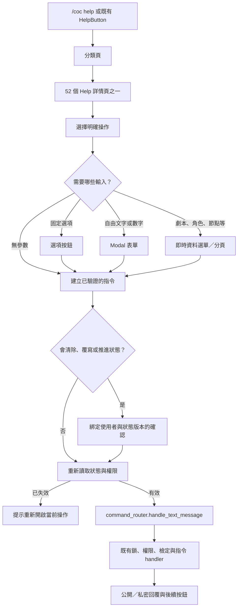
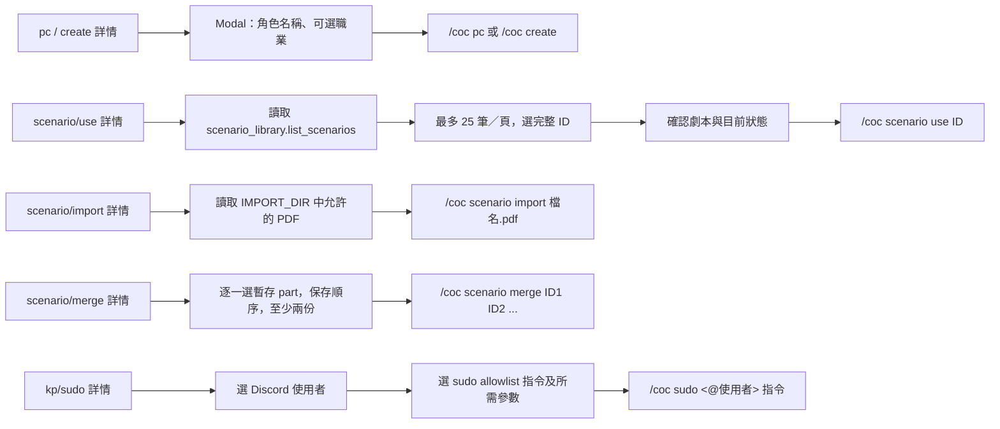

# Actionable Discord Help Buttons — Design Spec

## Status and goal

Draft for review. Branch: `enhancement/actionable-help-buttons`. Integration branch: `main_v2`.

Today, Discord `/coc help` provides persistent root → category → detail navigation. A detail page prints the command syntax, but its buttons only navigate back. **All 52 entries currently registered in `app/help_registration.py` must have a working button path**, including multi-step KP commands. The button invokes the existing command behavior using the clicking user's identity and current channel state. The text command remains available. If a command's prerequisite is absent, the action opens the relevant picker or displays the command handler's specific explanation; it never presents an inert **執行** button.

The first priority is:

- `/coc pc 角色名 [職業]` and `/coc create 角色名 [職業]`: pressing **建立角色** opens a form for the name and optional occupation; submission starts the same character command.
- `/coc scenario use 劇本ID`: pressing **選擇劇本** loads the current library and presents titles with IDs in a paged select; selection uses the selected library ID, not a title typed by the user.

## Existing interfaces

- `app/help_registry.py`: `HelpEntry`, `HelpPage`, `HelpAction`, visibility and path lookup.
- `app/help_registration.py`: central metadata for all help entries and their `command` token prefixes.
- `app/help_service.py`: re-renders pages from current `GroupState`.
- `app/discord_bot.py`: persistent `HelpButton` currently handles navigation only. `on_message` gives actual text commands to `command_router.handle_text_message`.
- `app/commands/router.py`: the authoritative command entry, conversation locks, check/Luck locks and handler routing. Character and scenario handlers apply their own state and permission checks.
- `scenario_library.list_scenarios()`: current library manifests, including ID and title; `scenario use` revalidates the selected ID with `load_context`.

## User flow

The help message stays available for everyone in the channel. Interaction forms, selections, and confirmations are scoped to the person who clicked. A successful operation sends the same public/private command output as the text path; input errors can be ephemeral. The displayed command syntax remains on the detail page.

### 特殊輸入流程圖

### Create a character

1. From the `pc` or `create` detail page, click **建立角色**.
2. Open a modal with required **角色名稱** and optional **職業**. The current parser treats each as one token, so the form validates nonempty values, length, and whitespace rather than silently splitting a multiword name/occupation.
3. On submission, reload current state. If the scenario gained pregens, the player already has a character or creation session, or the clicker became KP Assistant, show the existing handler's response. The modal itself grants no exception.
4. Build the exact `/coc pc ...` or `/coc create ...` command from validated fields and dispatch through the shared command router with `interaction.user.id`.
5. The existing character handler creates the sheet/session and persists it; help never calls `generate_investigator` or `creation.start_creation` itself.

The `create` detail also offers the existing session operations `status`, `done`, and `cancel`; `alloc` uses a form for pool, skill and points.

### Select a scenario

1. From the `scenario/use` detail, click **選擇劇本**. Read `scenario_library.list_scenarios()` at that moment; show title and short ID while storing the full ID as the option value.
2. Page the list at no more than 25 options per select. Include previous/next controls and an empty-library message. Never truncate the library silently.
3. Bind the temporary select to the clicker and channel. Before executing, check the selected full ID is still present in a freshly loaded library list. Then dispatch `/coc scenario use <ID>` through the existing router.
4. The command handler remains responsible for KP Assistant authorization, pending Luck/upload guards, context loading, timeline reset, pregen installation and persistence. A title, page index or stale option is never treated as an authority to load a scenario.
5. Changing a scenario is consequential: show its title and a confirmation step before dispatch. Recheck current state and library again on confirmation.

Discord's current component docs describe select options and modal inputs; the installed library is `discord.py>=2.4.0`. The implementation should use the APIs available in the installed version and keep option paging at 25. See [discord.py UI API](https://discordpy.readthedocs.io/en/stable/interactions/api.html) and [Discord component reference](https://docs.discord.com/developers/components/reference).

## 52/52 Help 條目操作對照

The registry must declare an explicit action plan for **every** entry. Do not infer an executable command from the first `usage` or `examples` string: those contain placeholders and sometimes several distinct operations. For commands with multiple suboperations, show named actions. Dynamic lists are paged and revalidated. `確認` means a private confirmation before the final command dispatch.

| 角色（12） | 按鈕與輸入 → 現有指令 |
| --- | --- |
| `character/pc` | 建立角色 → 姓名／可選職業 Modal → `/coc pc` |
| `character/create` | 開始建角 → 姓名／可選職業 Modal → `/coc create`；另有 status、done、cancel（cancel 確認） |
| `character/pregens` | 查看清單 → `/coc pregens`；若劇本尚無預製卡，既有 handler 可抽取 |
| `character/pregen` | 即時預製角色選單 → `/coc pregen 編號` |
| `character/usepregen` | 即時預製角色選單 → 可選自訂名稱 Modal → 確認 → `/coc usepregen 編號 [名稱]` |
| `character/sheet` | 查看自己的角色卡 → `/coc sheet` |
| `character/setskill` | 目前角色名稱由 state 帶入；技能與整數值 Modal → `/coc setskill` |
| `character/setconnection` | 目前角色名稱由 state 帶入；描述 Modal → `/coc setconnection` |
| `character/alloc` | 職業／興趣池選擇，技能與點數 Modal → `/coc alloc` |
| `character/characters` | 列出自己的角色 → `/coc characters` |
| `character/switch` | 自己擁有的角色選單 → `/coc switch 角色名` |
| `character/retire` | 目前角色或自有角色選單 → 確認 → `/coc retire [角色名]` |

| 檢定（3） | 按鈕與輸入 → 現有指令 |
| --- | --- |
| `check/check` | 目前待處理檢定的技能／互斥選項選單 → `/coc check [選項]`；無待處理檢定時顯示 handler 的說明，不憑 Help 建新骰 |
| `check/autoroll` | 查看、開、關三個操作 → `/coc autoroll [on/off]` |
| `check/luck` | 待擲預製角色 Luck 時提供 roll；待決一般檢定時提供 skip／regular／hard／extreme → `/coc luck ...`；沿用現有 pending 身分與時間線驗證 |

| 戰鬥（7） | 按鈕與輸入 → 現有指令 |
| --- | --- |
| `combat/start` | 確認 → `/coc combat start` |
| `combat/addnpc` | 名稱、DEX、HP Modal → 確認 → `/coc combat addnpc ...` |
| `combat/addally` | 名稱、DEX、HP Modal → 確認 → `/coc combat addally ...` |
| `combat/status` | 查看戰鬥狀態 → `/coc combat status` |
| `combat/next` | 顯示目前輪次／行動者 → 確認 → `/coc combat next` |
| `combat/damage` | 戰鬥目標選單及有號整數 Modal → 顯示增減量確認 → `/coc combat damage ...` |
| `combat/end` | 確認 → `/coc combat end` |

| 地圖（4） | 按鈕與輸入 → 現有指令 |
| --- | --- |
| `map/showpage` | 有存圖頁碼選單；若沒有索引則頁碼 Modal → `/coc showpage 頁碼` |
| `map/where` | 查看位置 → `/coc where` |
| `map/enter` | 目前 `scene_maps` 的地圖頁碼選單 → `/coc enter 頁碼` |
| `map/leavemap` | 確認 → `/coc leavemap` |

| 劇本與局次（18） | 按鈕與輸入 → 現有指令 |
| --- | --- |
| `scenario/newgame` | 顯示將重置群組狀態 → 確認 → `/coc newgame` |
| `scenario/list` | 列出即時劇本庫 → `/coc scenario list` |
| `scenario/use` | 即時劇本庫分頁選單 → 顯示標題與 ID 確認 → `/coc scenario use ID` |
| `scenario/cards` | 選劇本 → 列出手動卡，或選資產並確認刪除 → `/coc scenario cards list/delete ...` |
| `scenario/reparse` | 有等待解析的上傳時確認 → `/coc scenario reparse` |
| `scenario/cancel` | 有等待處理的上傳時確認 → `/coc scenario cancel` |
| `scenario/clean` | 選劇本庫項目 → 顯示使用狀態與 ID 確認 → `/coc scenario clean ID` |
| `scenario/import` | 列出 `IMPORT_DIR` 中允許的 PDF 檔名並分頁選擇 → 確認 → `/coc scenario import 檔名.pdf`；仍由 `safe_import_path` 驗證 |
| `scenario/merge` | 列出暫存 parts → **逐一**選擇以保留合併順序，至少兩份 → 確認 → `/coc scenario merge ID1 ID2 ...`；也提供既有 list 操作 |
| `scenario/pdf` | 待處理 PDF 的 new／fix 選擇 → 確認 → `/coc pdf new/fix` |
| `scenario/status` | 查看狀態 → `/coc status` |
| `scenario/start` | 開始劇情 → `/coc start`；現有 handler 決定是否可開場 |
| `scenario/end` | 顯示將結束局次並解除 KP 身分 → 確認 → `/coc end` |
| `scenario/setpersona` | 查看目前風格、文字 Modal 設定、reset 確認 → `/coc setpersona ...` |
| `scenario/era` | 查看目前年代；1920／modern 選項 → `/coc era ...` |
| `scenario/index` | 確認重建索引 → `/coc index` |
| `scenario/away` | 標記暫離 → `/coc away` |
| `scenario/back` | 回到遊戲 → `/coc back` |

| KP（7） | 按鈕與輸入 → 現有指令 |
| --- | --- |
| `kp/kp` | 登記或 quit（quit 確認）→ `/coc kp [quit]` |
| `kp/sudo` | Discord 使用者選單 → `sudo_policy` allowlist 指令選單 → 指令專屬參數表單／選單 → 顯示目標與操作確認 → `/coc sudo <@玩家> ...`；不提供被禁止的創角、認領或 Luck roll |
| `kp/checkpoint` | 可選名稱 Modal 建立，或選現有節點並確認 clean → `/coc checkpoint [名稱]/clean ID` |
| `kp/checkpoints` | 查看節點清單 → `/coc checkpoints` |
| `kp/rollback` | 即時節點選單 → 顯示將回溯到的節點確認 → `/coc rollback ID` |
| `kp/digest` | 查看最新、選歷史摘要，或選摘要並確認 clean → `/coc digest [ID]/clean ID` |
| `kp/digests` | 查看摘要清單 → `/coc digests` |

| 其他（1） | 按鈕與輸入 → 現有指令 |
| --- | --- |
| `other/roll` | 骰式 Modal → `/roll 骰式`，仍由原本的 roll handler 執行 |

Every registered path above has an actionable route. A missing prerequisite produces an explicit result from the existing handler or a current-state picker; it is **not** treated as a permanent help-only exception. File attachments are not among the current 52 Help entries. Uploading a new local PDF/role/map file still begins with Discord's attachment flow; `scenario/import` chooses a PDF already in the server's allowed import directory.

## Action model and command dispatch

Add a small, validated `HelpExecution` definition keyed by canonical `HelpEntry.path`: one or more action IDs, labels, input kinds, explicit command tokens or typed command builders, and confirmation policies. Registration rejects duplicate action IDs, unknown paths, empty command plans and any built-in Help entry without at least one executable action. Runtime lookup rejects an action whose entry is no longer visible. Keep this metadata independent of Discord so it can be tested and documented. The coverage invariant is `set(action_paths) == set(all_help_entry_paths)` (52/52 at this revision).

`HelpButton` remains the persistent navigation entry. The detail page adds a separate persistent action button whose custom ID carries only version, channel and action ID. Dynamic callbacks resolve the current registry definition; they do not trust a command string, scenario ID, target user, permission flag or result text from the custom ID. Temporary modal/select/confirmation callbacks bind actor ID and original channel. Validate custom ID length and action identifiers.

The adapter builds validated command text only at the final step and calls `command_router.handle_text_message` with the same callbacks used by `on_message`: display name, reply, DM, image, mention formatter, Discord Keeper role and post-turn hook. It must not call handlers directly or emit a fake user message. For long operations, acknowledge the interaction before work and send follow-up output through the existing reply helpers; for modals, opening the form is the initial response. Final output and pending Check/Luck buttons must follow the same delivery and claim logic as text commands.

On final submission, pass the observed state revision/timeline and selected object's stable ID to the command router as a guarded request. The router validates the guard **after acquiring its existing command lock and before entering the handler**; the adapter must not acquire that lock and then call the router because the lock is not reentrant. Long scenario operations that release the conversation lock for extraction revalidate their selected object and guard again at the existing short commit boundary. A stale form offers to reopen the current help page rather than applying an outdated choice. The handler still enforces its own authorization and game rules. Consequential confirmations are single-use for a given actor and observed revision; a second submit cannot silently execute the same captured action twice. No new `GroupState` fields or database schema are planned; temporary UI state lives only for the interaction lifetime, and the persistent help button can always reopen it after restart.

## Scope and non-goals

- Discord help only; other platforms keep their text commands.
- Preserve the three-level help navigation and generated `docs/player_command_reference.md`.
- Preserve command semantics, permission checks, parser rules and public/private output.
- Do not let the LLM choose commands or create executable action metadata.
- Do not add a generic arbitrary-command form; all 52 entries need reviewed typed action plans.
- Do not silently execute destructive operations from a single detail click.
- New file attachments outside the registered Help commands continue to enter through Discord's attachment flow; this does not exempt any existing Help entry from an executable action.

## Verification

- Registry tests assert exact 52/52 path coverage, each multi-operation entry's named actions, unique action IDs, valid argument builders and component bounds. A new Help entry without an execution plan fails the test.
- Adapter tests cover persistent IDs after restart, channel scope, clicker binding, modal values, paged selects including an empty library and more than 25 scenarios, stale/deleted IDs, changed state/timeline, expired temporary views and duplicate confirmation.
- Integration tests compare button and text routes for character creation and scenario selection, including the same stored state and visible reply. Exercise at least one action from each of the seven categories, plus every multi-step family: creation, pregen, check/Luck, combat target/damage, scenario import/merge/cards, checkpoint/rollback/digest, and sudo.
- Test that a non-KP cannot select a scenario even from another user's help message, that a player with pregens cannot use custom character creation, and that clicking a command twice cannot double-apply a consequential action.
- Run the full unit suite, Ruff and mypy. Before a PR, fetch and align with latest `main_v2`.

## Review checkpoint

Coverage is decided: implement all 52 currently registered Help entries. The remaining review is of the interaction details and confirmation list above. The branch has no runtime changes yet.
