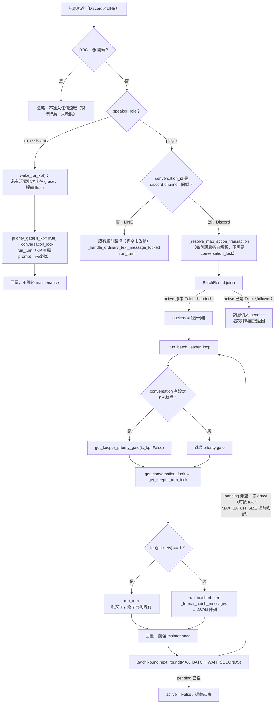

# 設計規格：玩家訊息批次合併送 AI（Dialogue Batching）

> 適用範圍：`main` 分支（`app/commands.py`／`app/keeper.py` 單檔架構，非 `main_v2`）。
> 僅涵蓋 Discord（`app/discord_bot.py`）；LINE（`app/main.py`）維持凍結，不在本次範圍內。

## 目標

目前每一則 Discord 玩家訊息都會各自觸發一次 `keeper.run_turn` → 一次 AI 呼叫。當多位玩家在短
時間內連續發言時，後面的訊息會卡在既有的 `get_keeper_turn_lock`／`get_keeper_priority_gate`
（`app/locks.py`）後面排隊，一則一則輪流跑，等待時間隨排隊人數線性增加。

本次要讓「Keeper 正在處理 A 的時候，B/C/D 在這段時間內送進來的訊息」改成暫存，等 A 處理完後，
把暫存的 B/C/D 合併成**一次** AI 呼叫一起處理，而不是各自再跑一次——一次處理一組訊息預期比
一次處理一句話的總延遲更低，且 AI 呼叫次數（成本）也會下降。

## 範圍與非目標

本期包含：

- 每個 conversation（= 每個 Discord 頻道，見下方「現況」）維護一個玩家訊息批次佇列。
- 修改 `keeper.py` 的單一發言者呼叫路徑，改為可接受多位發言者的一批訊息，合併成一次 AI 呼叫。
- AI 回覆中對不同角色分別要求擲骰時，各自產生正確歸屬的擲骰按鈕（`coc_check:{conversation_id}:
  {owner_id}:{option}`）——這部分**不需要新增程式邏輯**，見下方「現況」第 3 點，現有機制已經支援。
- 明確排除 KP 控場訊息進入玩家批次（見下方「污染防護」）。
- `tests/test_message_batching.py`，涵蓋批次合併、逾時強制送出、KP 插隊、空批次/單則批次的
  回歸行為。

本期不包含：

- 不新增「這句話是不是在跟 AI 說話」的語意分類器。現有唯一的硬過濾仍然只是 `_is_ooc_message`
  的 `@`／`<@` 開頭前綴（`app/discord_bot.py:35-37`）——這是既有行為，不在本次改動範圍，也不會
  因為批次化而變得更寬鬆或更嚴格。
- 不改動 `get_keeper_priority_gate` 的 KP 優先權邏輯本身（`app/locks.py:46-90`）——KP 永遠優先
  處理、永遠不與玩家訊息合併，本次只是在既有規則上加一層「玩家端的合併」。
- 不改動 LINE（`app/main.py`）。
- 不影響 `main_v2` 分支。

## 現況

### 1. 訊息入口與呼叫鏈

`app/discord_bot.py:406` 的 `on_message` 收到訊息後，排除 bot 自己與 OOC 訊息
（`_is_ooc_message`），非附件類訊息會呼叫 `commands.handle_text_message(...)`
（`discord_bot.py:502`），最終落到 `app/commands.py:1373` 的
`_handle_ordinary_text_message_locked`，呼叫：

```python
# app/keeper.py:1647
keeper.run_turn(state, user_id, display_name, text, resolved_location, speaker_role)
```

**一則 Discord 訊息 → 一次 `run_turn` 呼叫 → 一次 AI 呼叫**，`run_turn` 的參數就假設了單一發言者
（單一 `user_id`／`text`）。

### 2. conversation_id 的範圍

`_conversation_id(channel_id) = f"discord-channel-{channel_id}"`（`discord_bot.py:54`）——
**每個頻道一個 conversation_id**，整個 session 期間固定不變，不是每則訊息或每次 AI 呼叫才產生
一個新的。也就是說，同一頻道裡不同玩家的所有發言，本來就共用同一個 conversation_id，批次合併
不需要重新設計 conversation_id 的產生方式。

### 3. 擲骰按鈕已經支援多位角色

`app/discord_bot.py:182` 的 `_post_check_buttons` 會遍歷 `state.pending_checks`（一個以
`owner_id` 為 key 的 dict）裡**所有**待處理的檢定，逐一貼出按鈕——它並不假設一次只有一位發言者。
`pending_checks[target_char.owner_id]`（`keeper.py:915`／`954`／`978`／`1014`）是 AI 執行
`skill_check` 工具呼叫時，根據角色名稱查出來的 owner_id 設定的，不是從呼叫 `run_turn` 時傳入的
`user_id` 帶入。

換句話說：**只要 AI 在一次回覆裡對不同角色分別呼叫 `skill_check` 工具，現有機制就已經會產生各自
正確歸屬的按鈕**——這正是原始構想裡「設計得好，應該有可行性」的部分，本次不需要改動這一段。

真正需要補的是下一點：目前 AI 一次只會收到一位發言者的輸入，所以自然也只會處理一位角色的意圖；
要讓 AI 在一次呼叫裡看到多位發言者、進而可能對多位角色分別要求檢定，需要先解決「怎麼把多人的話
一起餵給 AI」。

### 4. 真正的缺口：單一發言者格式化

`app/keeper.py:1581` 的 `_format_turn_message(speaker_name, message_text, speaker_role)`：

```python
f"{speaker_name}：{message_text}"
```

只接受單一發言者。`_commit_turn_result` 目前也是每個 turn 記一組 `user`/`assistant` 歷史紀錄。
這是本次唯一需要新增邏輯的地方。

### 5. 既有的並發控制（`app/locks.py`）

- `get_conversation_lock`：整個訊息處理過程持有的粗粒度 per-conversation 鎖。
- `get_keeper_turn_lock`：序列化同一 conversation 的 AI 呼叫（同一時間只有一次在跑）。
- `get_keeper_priority_gate(conversation_id, is_kp)`：`_KeeperPriorityGate`
  （`locks.py:46-90`），FIFO 佇列，KP 與玩家分開排隊，**KP 永遠優先被放行**，只有在該
  conversation 已設定 KP 助手時才啟用。

**這個佇列機制已經存在**——目前的行為是：B 訊息進來時若 A 正在處理，B 會卡在 gate 後面等待，
等輪到它時「各自」跑一次 `run_turn`。本次要做的改動，就是把「等待期間陸續進來的多則訊息」從
「各自排隊、各自呼叫」改成「合併成一次呼叫」，其餘的鎖與優先權機制原封不動沿用。

### 6. KP 控場訊息的判斷方式

沒有獨立的控場頻道。KP 助手是 state 上的一個 `user_id` 旗標
（`state.kp_assistant_user_id`），`speaker_role`（`"player"` 或 `"kp_assistant"`）由
`_handle_ordinary_text_message_locked`（`commands.py:1396`）依此旗標判斷。KP 訊息會走不同的
prompt／工具白名單（`_KP_ASSISTANT_ALLOWED_TOOL_NAMES`、`_tools_for_speaker_role`），且只有
明確的 `!` 前綴（`_parse_kp_manual_canon_trigger`）才會寫入 canon。

### 7. 既有測試慣例

最相關的是 `tests/test_keeper_priority_gate.py`、`tests/test_keeper_priority_integration.py`
——直接測試 `locks.py` 的 gate 與 `commands.handle_text_message`，慣例是 stdlib `unittest` +
`asyncio.run`（不用 `pytest-asyncio`），用 `StateStorePatch` context manager mock
`load_state`/`save_state`、`ReplyCollector` 收集回覆、`FakeKeeperRunner` stub 掉
`keeper.run_turn`。本次新測試會沿用同一套慣例。

## 設計

### 整體流程圖



重點對照左右兩條路徑：**KP（D→E→F）跟 LINE 玩家（H）完全是既有程式碼，本次沒有改動一行**；
只有「Discord 玩家」這條路徑（G 的「是」分支）會經過新的 `BatchRound`／JSON 邏輯。灰色的
`M → N → ... → U → V → M` 是 leader 反覆處理多輪批次的迴圈，`follower`（`L`）則是單純把訊息
掛進去就返回，不會自己觸發任何 AI 呼叫。

### 批次視窗：只有「Keeper 忙碌中」才批次，閒置時第一則訊息照舊立即送出

（此節已依 Marco review 意見定案：採用原本列在待決策事項 #2 的修正版，拿掉「情境 A」。）

原始構想是「Keeper 正在處理 A 時，B/C/D 在接下來 X 秒內送進來就暫存」——只描述了 Keeper 忙碌
時的情境，不包含「Keeper 閒置時第一則訊息也要多等」。因此：

- **Keeper 目前閒置**，某玩家訊息進來——**立即**送出，行為與現行完全一致，零額外延遲。批次機制
  完全不介入單則、無競爭的情境。
- **Keeper 目前忙碌**（一次 AI 呼叫進行中），玩家訊息進來——加入「下一批」的佇列，不再各自排隊
  等著跑單獨一次。目前這次 AI 呼叫結束後，若佇列非空，**直接把目前累積的整批送出**，不另外
  等待計時器——因為批次的起點本來就是「這次呼叫進行的這段時間」，呼叫一結束，這段時間內能收到
  的訊息就都到齊了，沒有必要為了等更多訊息而讓已經在等待的人繼續等。
  - 唯一保留的計時器是 `MAX_BATCH_WAIT_SECONDS`（**預設 3 秒**，合理範圍 2–5 秒，可透過
    `app/config.py` 環境變數 `MAX_BATCH_WAIT_SECONDS` 調整）：用來處理「當前這次呼叫結束的那個
    瞬間，可能還有訊息正在路上（玩家正在打字，晚了零點幾秒送出）」——批次在準備要 flush 的那一刻，
    給一個最多 `MAX_BATCH_WAIT_SECONDS` 的極短寬限期，讓幾乎同時抵達的訊息也能搭上同一批，而不是
    卡在下一批。這不是「刻意讓玩家多等」的設計，而是「即將要送出前的最後收尾」，超過寬限期就照原
    佇列內容立即送出，不再延後。
  - `MAX_BATCH_SIZE`（**固定 5 則**，本期不做成可調參數）：不論計時器是否到期，佇列一旦累積滿
    5 則就立刻強制送出，避免極端情況下單次 prompt 過長、AI 一次要處理的意圖過多。
- **KP 插隊（preemption）**：若玩家批次正在寬限期內（尚未送出）時，KP 助手發言進來——立刻把目前
  累積的玩家批次送出（視為一次完整的批次呼叫），接著才處理 KP 的訊息（走現有的 solo 路徑，不
  進入任何批次）。這維持「KP 永遠優先、永遠不與玩家訊息混在同一次呼叫」的既有不變式
  （見現況第 5、6 點），只是新增「玩家批次不能無限期擋在 KP 前面」這條規則。

### 忙碌狀態怎麼判斷：新增一個 per-conversation「批次輪次」旗標，不是輪詢既有的鎖

不能用 `get_conversation_lock(...).locked()` 或 `get_keeper_turn_lock(...).locked()` 這種方式
在外面輪詢——那兩個鎖是「訊息抵達後才去 `await acquire()`」的東西，外面先 `.locked()` 檢查一次
再決定要不要排隊，中間有競態窗口（檢查完到真的排隊之間，持有者可能已經換手），而且「已經拿到鎖」
代表的是「排到我了」，不是「現在正在忙」這個時間點本身的訊號。

改成在 `app/locks.py` 新增一個小型 per-conversation 結構，維護的是**這一輪批次本身**的狀態，
跟既有的鎖是分開的兩件事：

```python
@dataclass
class BatchRound:
    pending: list[QueuedMessage] = field(default_factory=list)
    active: bool = False                      # True = 這輪批次正在跑或正在寬限期收單
    grace_wake: asyncio.Event = field(default_factory=asyncio.Event)  # 提前結束寬限期
    _next_seq: int = 0
    _lock: asyncio.Lock = field(default_factory=asyncio.Lock)  # 只保護這個物件自己的欄位

    async def join(self, *, user_id, speaker_name, text, resolved_location) -> tuple[bool, QueuedMessage]:
        """True＝呼叫方是這一輪的 leader（負責觸發／收尾這一批）；
        False＝只是把訊息掛進去，會被目前這輪的 leader 一起帶走。"""
        async with self._lock:
            self._next_seq += 1
            packet = QueuedMessage(seq=self._next_seq, user_id=user_id, speaker_name=speaker_name,
                                    text=text, received_at=time.monotonic(), resolved_location=resolved_location)
            self.pending.append(packet)
            if len(self.pending) >= MAX_BATCH_SIZE:
                self.grace_wake.set()
            if self.active:
                return False, packet
            self.active = True
            return True, packet

    async def wake_for_kp(self) -> None:
        """KP 訊息抵達時呼叫：若目前有排隊中的玩家批次，提前結束它的寬限期。"""
        async with self._lock:
            if self.pending:
                self.grace_wake.set()

    async def next_round(self, max_wait_seconds: float) -> list[QueuedMessage] | None:
        """Leader-only，每輪 Keeper 呼叫結束後呼叫一次：回傳下一批要處理的訊息，
        或 None（這輪批次結束，`active` 同時翻回 False）。"""
        async with self._lock:
            if not self.pending:
                self.active = False
                return None
            wake_event = self.grace_wake
        try:
            await asyncio.wait_for(wake_event.wait(), timeout=max_wait_seconds)
        except asyncio.TimeoutError:
            pass
        async with self._lock:
            batch, self.pending, self.grace_wake = self.pending, [], asyncio.Event()
            if not batch:
                self.active = False
                return None
            return batch
```

**「忙碌」直接定義成 `active == True`**：從第一則觸發某一輪的訊息開始（不論這一輪是立即送出的
單則，還是還在寬限期收單），一路涵蓋到這一輪的 AI 呼叫真正回覆完成為止，才會回到 `active =
False`（閒置）。中間不管是「AI 正在跑」還是「AI 剛跑完、正在等 grace 收尾」，對外表現都是同一
件事——忙碌，新訊息一律進 `pending`，不會再各自觸發一輪。這是刻意簡化過的「一輪批次的生命週期」
概念，跟 Keeper 是否正巧在呼叫 LLM 的那一瞬間沒有直接綁定，比綁在既有兩個鎖的 `.locked()` 狀態
上更不容易踩到邊界競態。

`join()` 回傳 `True` 的呼叫方（leader，`app/commands.py` 的 `_run_batch_leader_loop`）接下來
的流程：

1. 若這是「閒置轉忙碌」的第一則——不進 grace，直接照現有流程走：拿
   `get_keeper_priority_gate`（若該 conversation 有設定 KP 助手）→ 跑
   `run_batched_turn([這一則])` → 回覆。這就是「Keeper 閒置時立即送出」，批次大小固定是 1，
   跟現行行為逐字元相同（見下一節）。
2. leader 每跑完一輪，呼叫 `next_round(MAX_BATCH_WAIT_SECONDS)`：`pending` 空的話直接回傳
   `None`（`active` 同時翻回 `False`，這輪結束）；非空的話先等寬限期（逾時或被
   `wake_for_kp()`／`MAX_BATCH_SIZE` 提前喚醒都會讓它提早返回），再把 `pending` 整批取走、清空、
   換一個新的 `grace_wake`，回傳這一批給 leader 送出下一次 `run_batched_turn`。leader 用一個
   `while packets is not None:` 迴圈反覆呼叫，直到某次 `next_round` 回傳 `None`。

`BatchRound` 只在自己的 `_lock` 底下做「append／翻旗標／清空快照」這幾個極短操作，**從不在持有
`_lock` 期間 await LLM 呼叫，也從不在裡面碰既有的 `get_keeper_turn_lock`／
`get_keeper_priority_gate`**——那兩個鎖仍然只由 leader 在真正要跑 `run_batched_turn` 前才去
acquire，語意跟現在完全一樣，差別只在於「誰去 acquire、acquire 幾次」從「每則訊息一次」變成
「每一輪批次一次」。

**KP 插隊的具體機制**：KP 訊息抵達時，`app/commands.py` 的 dispatcher 呼叫
`get_batch_round(conversation_id).wake_for_kp()`——若該 conversation 目前有一輪 `active` 的
玩家批次正卡在 grace（`pending` 非空），提前結束它的寬限期，讓 leader 立刻把目前 `pending`
送出，接著 KP 自己照現有路徑走 `get_keeper_priority_gate(is_kp=True)`（既有機制已保證 KP 排在
其後任何新排隊的玩家前面）。若該 conversation 沒有任何批次在跑（例如 LINE，或這個 Discord
頻道剛好沒人在排隊），這個呼叫就是無操作。若玩家批次當下正在跑 AI（leader 卡在 LLM 呼叫本身，
不是 grace）——沒辦法中斷一個已經送出去的 LLM 呼叫，KP 只能照現有 gate 規則排隊等它結束，這跟
現行「KP 永遠優先、但不會搶斷正在跑的那一次呼叫」的行為一致，批次化沒有讓這件事變得更糟。

### 訊息封裝：批次大小 > 1 時改用 JSON 陣列（2026-09-20 修訂，見下方「與現有純文字風格的取捨」）

批次送給 AI 時，每則排隊中的訊息都帶著 `(seq, user_id, speaker_name, text, received_at,
resolved_location)`（`app/locks.py` 的 `QueuedMessage`）。**只有批次大小 > 1 時**，
`_format_batch_messages` 才會把這些訊息序列化成一段「文字指示＋JSON 陣列」；**批次大小 = 1 時
完全不受影響，直接委派給既有的 `run_turn`／`_format_turn_message`，輸出與現行逐字元相同**——
這是刻意的回歸保護：多數情況下（沒有排隊競爭）批次大小仍然是 1，不能因為改成批次架構而讓最常見
情境的 prompt 內容產生變化、進而影響既有的 AI 回覆品質或既有測試的 snapshot。

批次大小 > 1 時的格式：

```
（以下是同一輪合併送達、來自不同玩家的 3 則發言，以 JSON 陣列表示，每個元素是一則獨立輸入，
請逐一判斷；某個元素若與當前情境無關（例如純聊天、離題），不要讓它的內容影響到其他元素的
動作判定或檢定）
[
  {"seq": 1, "speaker": "小明", "message": "我要對著門開鎖"},
  {"seq": 2, "speaker": "小華", "message": "哈囉我剛回來 XD"},
  {"seq": 3, "speaker": "阿強", "message": "我掩護小明"}
]
```

`user_id`（Discord snowflake）不放進 JSON——AI 只需要 `speaker`（角色名）來對應 `skill_check`
工具呼叫時要查的角色名稱（見「現況」第 3 點，擲骰按鈕已經靠角色名查 `owner_id`，不需要 AI 知道
原始 user_id）；`seq` 保留純粹是為了讓 AI 在回覆裡能明確指出「針對第幾則」，也方便測試斷言順序。

`_format_batch_messages(packets: list[QueuedMessage]) -> str` 這個函式的輸出仍然是**一個
純字串**——`provider.run_conversation(..., new_message: str, ...)`（三個 provider：
`app/providers/anthropic_provider.py`／`gemini_provider.py`／`openai_provider.py`）本來就只
接受字串、不解析其內部結構，`state.log` 存的也是 `{"role": "user", "content": <字串>}`，所以
「內容是不是 JSON」對整條 pipeline是透明的，只有 `_format_batch_messages` 這一個函式知道差別，
不需要改動 provider 層或 history 的資料結構。

`keeper.py` 新增 `run_batched_turn(state, packets, resolved_location, ...)`，取代
`commands.py:1373` 目前呼叫 `run_turn` 的呼叫點；批次大小 = 1 時內部直接委派給 `run_turn`。

#### 與現有純文字風格的取捨，以及為什麼不影響 KP

這個專案目前沒有任何地方把原始 JSON 塞進敘事類 prompt——連 KP 助手的工具執行紀錄
（`_format_kp_canonical_history_message`，`keeper.py:1601`）都刻意格式化成人類可讀的文字區塊
（`[DETERMINISTIC GAME WORKFLOW]` + 一行一個 `tool:`/`input:`/`result:`），不是直接 dump
JSON。改用 JSON 陣列是 Marco 在 review 時明確要求的例外，取捨考量記錄在此：換來的是「元素邊界
對 AI 更明確、更不容易把離題發言的語意套用到別行」，代價是這個 codebase 第一次在敘事 prompt
裡出現原始 JSON，跟既有風格不一致。

**這個改動完全不影響 KP**，原因是結構性的，不是靠額外檢查：

- KP 助手的訊息（`speaker_role == "kp_assistant"`）**從來不會進入 `BatchRound`**——
  `app/commands.py` 的 dispatcher 對 KP 訊息維持原本的 solo 路徑（`get_keeper_priority_gate`
  → `get_conversation_lock` → `run_turn`），跟批次機制完全是兩條分開的程式碼路徑，KP 訊息
  永遠不會被 `_format_batch_messages` 處理到。
- KP 專屬的 `[KP Assistant] {message_text}` 格式（`_format_turn_message`，`keeper.py:1582`）
  跟 `_format_kp_canonical_history_message` 都**沒有任何改動**，本次只新增
  `_format_batch_messages` 這一個新函式，不修改既有函式的行為。
- KP 訊息抵達時唯一會碰到 `BatchRound` 的動作是 `wake_for_kp()`——只是提前結束「別人的」玩家
  批次寬限期，不會把 KP 自己的訊息塞進那個批次，也不會讓 KP 的訊息被序列化成 JSON。

### 污染防護：離題訊息混入批次的風險

Marco 提出的疑慮——一堆訊息裡有人打了一句沒有 `@` 的閒聊，AI 可能誤解語意讓整串跑掉。這個風險
**在單則訊息時代本來就存在**（現況第 7 點／既有的 `_is_ooc_message` 只過濾 `@` 開頭，其餘一律
送給 AI），批次化不會製造新的風險類型，但會放大影響範圍：原本一句離題話最多讓那一次回覆跑掉，
批次化後可能連帶讓同批的其他 N 位玩家的正經發言都被誤判。

本次採取的因應方式（不做語意分類器，理由見「範圍與非目標」）：

1. **JSON 陣列的逐元素結構**（上一節的封裝格式）本身就是主要防線：每則訊息是陣列裡獨立的一個
   物件（`{"seq", "speaker", "message"}`），不是揉成一段連續敘述，讓 AI 更容易把離題的那個
   元素當成獨立、可以單獨略過或簡短回應的輸入，而不會把它的語意套用到其他元素的動作判定上——
   比純文字逐行格式的邊界更明確，這也是改用 JSON 的主要理由（見「與現有純文字風格的取捨」）。
2. **文字指示需要新增明確指示**（放在 JSON 陣列前面，見上一節）：告知 AI「同一批可能包含來自
   不同玩家、彼此無關的輸入，其中可能有純聊天、與當前場景無關的內容；請個別判斷每個元素，不要
   讓離題內容影響其他元素的判定」。這段指示由 `_format_batch_messages` 產生，不是寫進固定的
   system prompt（理由見上一節），需要在實作階段用測試腳本驗證批次 prompt 的實際內容包含它。
3. `_is_ooc_message` 的 `@` 前綴過濾維持不變，仍然是唯一的硬性排除機制。

### 歷史紀錄（`_commit_turn_result`）——已定案：記為一筆

批次呼叫產生的一組「使用者輸入（多行）＋ AI 回覆（一則）」，記為**一筆**歷史紀錄（`user` side
是上述多行合併文字，`assistant` side 是 AI 的回覆），不拆成 N 筆各自獨立的 user/assistant
配對——這樣歷史紀錄重播時，看到的內容會跟 AI 當初實際看到的輸入一致，且不需要為 `_commit_turn_result`
的資料結構新增「一筆 assistant 回覆對應多筆 user 輸入」這種一對多關聯。

## 已定案事項

- ~~情境 A（Keeper 閒置時第一則訊息也要多等視窗）~~——已拿掉，Keeper 閒置時第一則訊息照舊立即
  送出，零額外延遲，只有 Keeper 忙碌期間排隊的訊息才會進入批次。
- `MAX_BATCH_WAIT_SECONDS` 預設 **3 秒**（合理範圍 2–5 秒），`app/config.py` 環境變數可調。
- `MAX_BATCH_SIZE` 固定 **5 則**，本期不做成可調參數，達到上限立即強制送出。
- 「忙碌」用新的 per-conversation `_BatchRound.active` 旗標判斷，不輪詢既有的
  `get_conversation_lock`／`get_keeper_turn_lock`——見「忙碌狀態怎麼判斷」一節。
- 批次的歷史紀錄記為一筆合併紀錄，不拆成多筆——見「歷史紀錄」一節。
- 批次大小 > 1 時的訊息封裝改用 JSON 陣列（`{"seq", "speaker", "message"}`），不用純文字逐行——
  Marco 在 review 時明確要求；批次大小 = 1 時不受影響，仍是純文字，見「訊息封裝」一節。**這個
  改動不影響 KP**——KP 訊息從不進入 `BatchRound`，也不會被 `_format_batch_messages` 處理到。

設計已無待決策事項，等 Marco 確認整份 spec 後即可開始實作。

## 測試計畫（`tests/test_message_batching.py`）

沿用 `test_keeper_priority_integration.py` 的慣例（stdlib `unittest`、`StateStorePatch`、
`ReplyCollector`、`FakeKeeperRunner`、`asyncio.run`）：

- `_BatchRound.join()`：第一次呼叫回傳 `True`（成為 leader）且 `active` 翻為 `True`；`active`
  為 `True` 期間再呼叫一律回傳 `False`，訊息確實進入 `pending`；leader 收尾且 `pending` 清空後
  `active` 翻回 `False`。
- Keeper 閒置時單一訊息立即送出，prompt 內容與現行 `_format_turn_message` 逐字元相同、不含
  多人批次宣告文字——回歸測試。
- Keeper 忙碌期間陸續進來兩則以上玩家訊息，會在目前這次呼叫結束後合併成一次呼叫送出，且送出的
  prompt 含有「同一輪合併送達」宣告文字，以及可以被 `json.loads` 解析、內容正確對應各則訊息
  （`seq`／`speaker`／`message`）的 JSON 陣列。
- KP 訊息（`speaker_role == "kp_assistant"`）不論任何情況都不會出現在 `_format_batch_messages`
  的輸出裡，且其自身的 `[KP Assistant] ...` 格式與現行 `run_turn` 逐字元相同——確認批次化／
  JSON 化完全不影響 KP 路徑。
- 寬限期內的 `MAX_BATCH_WAIT_SECONDS` 到期時，立即送出目前累積的批次。
- 佇列累積滿 `MAX_BATCH_SIZE`（5 則）時，不等寬限期到期就立刻強制送出。
- KP 訊息在玩家批次寬限期內進來：先強制送出玩家批次（單獨一次呼叫），再處理 KP 訊息（單獨一次
  呼叫），兩者不會合併，且順序正確。
- 一次批次呼叫中，AI 對多位不同角色分別呼叫 `skill_check`，各自產生正確歸屬 owner_id 的擲骰
  按鈕（延伸既有 `_post_check_buttons` 的測試覆蓋）。
- `@` 開頭的 OOC 訊息不進入批次、也不送給 AI，行為與現行一致。
