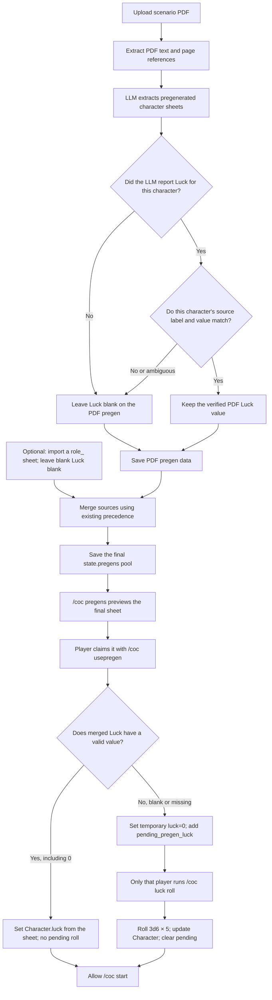

# Use the Luck Value on the Final Pregenerated Character Sheet

## Goal and Current Behavior

Today, `/coc usepregen` creates a character with `luck=0` and asks the player
to run `/coc luck roll`, even when the sheet already contains a Luck value.
This discards Luck values extracted from a PDF, imported from a manual sheet,
or retained after the two sources are merged.

The new rule uses **the final pregenerated sheet offered to the player**.
If that sheet has a Luck value, use it. Only when Luck is still blank or
missing after merging does the player roll `3d6 × 5` after claiming the
character. The pregenerated sheet template must keep `幸運 LUCK：` blank;
it must not insert `0` or a generated value.

## Scope and Non-Goals

- Cover PDF extraction, `role_` manual sheets, the merged pregen pool,
  previews, the `/coc usepregen` command and its shared claim helper, and the pending-Luck gate
  before play starts.
- Keep `/coc luck roll` player-owned for sheets whose Luck remains blank.
  The Keeper and `/coc sudo` cannot roll on the player's behalf.
- Do not change the other eight base attributes, ordinary `/coc pc` or
  `/coc create` creation, Luck on an already claimed character, or the
  shared pregen pool when a player rolls Luck.

## Data and Merge Rules

Do not add a marker meaning "never fill Luck" to a blank manual sheet.
The `role_` template keeps `幸運 LUCK：` blank, and its parser continues
to represent that blank field as missing. PDF extraction must report only
values explicitly present in the source; it must not calculate missing Luck.

### Source Verification During PDF Parsing

The current `extract_pregens()` tool description already tells the LLM to
report only explicit values, without inventing or calculating missing ones.
`luck` is optional, and the program does not roll or assign a default during
PDF parsing. However, before an extracted pregen enters the pool, the
program currently does **not** verify that an LLM-reported Luck value appears
on **that character's sheet**. The prompt alone cannot guarantee that a
blank field stays blank.

Require a locatable source for every Luck value extracted from a PDF, such
as the character sheet's page or block and a short excerpt containing both
the `LUCK` or `幸運` label and its value. Before saving the extracted pregen,
verify that the excerpt belongs to that character and that its label and
number agree with the reported value. If the source cannot be found or is
ambiguous, remove that pregen's `luck` and record a diagnostic for manual
review. A Luck number belonging to another character or to scenario prose
must not fill this field. This conservative rule may send an OCR-damaged
sheet through the player-roll path; the Keeper can correct it by importing
a manual sheet.

## Target Flow: From PDF Parsing to Starting Play

This diagram describes the behavior after implementation. Source
verification of PDF Luck and direct use of a final sheet value are the new
steps. A `role_` sheet may be imported before or after the PDF; both orders
  reach the same merge and claim decision. On the first PDF upload, preserve
  any already imported `role_` candidates through library-context loading
  so they can actually enter that merge.

Neither PDF parsing nor merging rolls Luck. If the PDF value reported by the
LLM cannot be verified, remove only that suspect source value. A verified
value on a manual sheet may still survive the merge. A player's eventual
roll is not written back to `state.pregens`, so future previews do not show
it as a shared sheet value.

Keep the current merge precedence: a filled manual Luck value wins; a blank
manual field can be filled by a verified PDF value; if both sources are
blank, the merged result remains blank. **Decide whether to roll only after
the merge, when the player claims `state.pregens[index]`.** Do not make this
decision from either source alone. For Luck specifically, an older record's
`None` or empty string must also count as blank, so another source's valid
number can fill it. Keep the precedence for other attributes unchanged.

| Final `luck` value | Result when claimed |
| --- | --- |
| Valid integer, including `0` | Set the new `Character.luck` directly; create no pending roll |
| Missing, `None`, or empty string | Temporarily set `luck=0`, add `pending_pregen_luck`, and wait for the player to roll |

An old pool entry containing a purely numeric string may use the existing
integer conversion. A boolean, negative number, or other invalid text must
not count as a filled Luck value. `Character.luck` remains an integer, and
`pending_pregen_luck` records only characters that actually need a roll.
No database schema change is needed.

No new UI or data migration decision is required. Keep the existing sheet
template, pregen pool, and pending-state structure; change the Luck value
check, claim behavior, and display text.

## Commands and Display

1. Shared `_claim_pregen()` reads the final pregen from the pool. Pass a
   valid sheet Luck value to the pure `pregen_to_character()` constructor.
   Use temporary `0` and create pending state only for blank Luck. Keep the
   existing claim, `claimed_by`, character ID, and save behavior.
2. `app/commands/handlers/character.py` invokes the shared claim helper in
   `app/legacy_commands.py` and responds according to its result. For a filled value, say
   that sheet Luck N was used and play may start. For a blank value, prompt
   the player to run `/coc luck roll`. Never show a roll prompt for a filled
   sheet.
3. `/coc pregen` previews a filled value as "Sheet LUCK N; retained when
   claimed" and a blank or missing value as "LUCK blank; player rolls after
   claiming." `0` is a filled value and must not be mistaken for blank by
   a truthiness check.
4. `/coc start`, scenario switching, and PDF handling are blocked only by
   actual pending rolls. If a character with sheet Luck runs
   `/coc luck roll`, retain the existing "no character awaiting a Luck roll"
   rejection. A player whose blank sheet required a roll cannot roll again
   after completing it.

This spec supersedes the "reroll Luck for every pregen" behavior and related
preview text in the [earlier Luck spec](pregen_luck_roll_design_spec.md).
Its skill aliases, persistent pending state, and ownership rules still apply.

## Acceptance Criteria

- Use Luck present on a PDF sheet, manual sheet, or final merged sheet. When
  manual Luck is blank and verified PDF Luck is filled, use the PDF value.
  Create pending state only when the final sheet is blank.
- Do not produce usable extracted Luck for a blank or missing PDF field, a
  value belonging to another character, or an LLM value without verifiable
  source evidence. Only an explicit value on that character's sheet may
  enter the merge.
- Keep Luck blank in the template. Parsing, merging, saving, and reloading
  blank sheets must not generate a Luck value.
- `/coc usepregen` and the shared claim helper agree on the message and pending behavior.
  A filled sheet can proceed directly to `/coc start`; a blank sheet needs
  that player's `/coc luck roll` first.
- Treat `0` and purely numeric legacy strings as filled. Never interpret
  invalid content as a sheet value.
- Do not change already claimed characters or the shared pregen when a
  player rolls. Continue rejecting duplicate claims and duplicate rolls.
