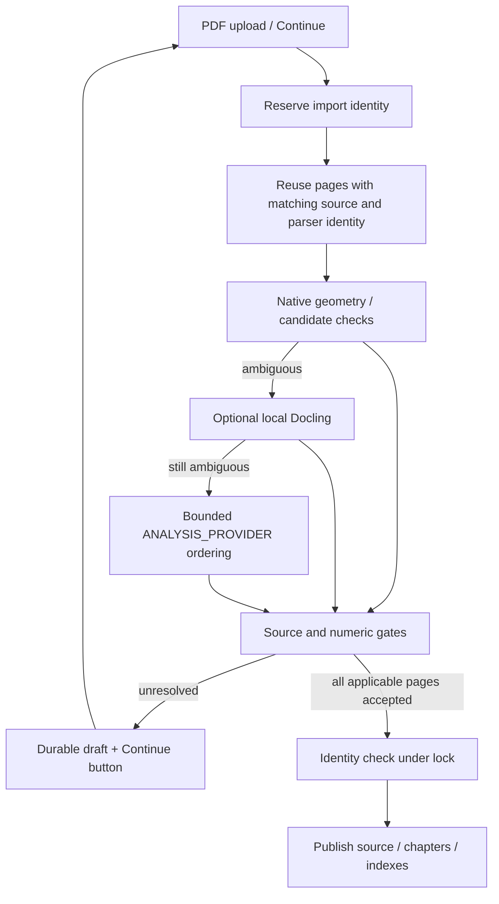

# PDF multicolumn ingestion and reading-order arbitration

[繁體中文](pdf_multicolumn_ingestion_design_spec_zh.md) | [Docs index](../../README.md)

Status: **implemented — PR review pending**. Base: `main_v2` at `7cef87c`. This proposal refines the external draft `pdf_ingestion_multicolumn_design_spec.md`; it does not change gameplay turn logic. “Approved scenario source” means published PDF-backed text, not an established world fact or an investigator discovery.

## Problem and measured baseline

The current PDF pipeline already has PyMuPDF geometry, PyMuPDF4LLM, MarkItDown, per-page numeric-pair checks, local OCR, bounded AI repair, image/map extraction, and diagnostics. `pdf_quality.select_text()` selects a candidate by text and numeric coverage; it does not validate the candidate's reading order. A text-complete page can therefore be wrong.

On the supplied PDFs, a one-page reproduction using the current selection functions found opposite winners:

| PDF physical page | Current choice | Visual reading-order finding |
| --- | --- | --- |
| `The_Haunting_Scenario_trimmed.pdf` 14 | PyMuPDF4LLM | The selected text places right-column Extension / Walter Corbitt before left-column Conclusion / Rewards. The native two-column order is correct. |
| `Dead Boarder.pdf` 5 | PyMuPDF4LLM | The native text moves right-column Rules Notes before left-column Keeper Considerations. The selected layout order is correct. |
| `The Lightless Beacon - Call of Cthulhu.pdf` 6 | Native | Both candidate heading orders agree; the layout candidate loses numeric evidence. |

These are review candidates, not a complete corpus or proof of all-page accuracy. The native text layer and any single parser can each be wrong.

## Goal and first-release scope

Improve native-text two-column pages and full-width headings using page geometry and per-page arbitration. Include Docling's full PDF layout pipeline as an optional challenger for difficult pages only. Preserve existing numeric, OCR, character-sheet, map, source-review, translation, and gameplay contracts. Use a small real-page golden corpus from the supplied scenarios; correct all known interleaved pages without regressing already-correct pages, numbers, dice expressions, or source spans.

Later phases may add structured table extraction (including Camelot where appropriate), region OCR/vision for scanned columns, and more complex sidebars. Marker and Nougat are not first-release dependencies. A scan without text-layer geometry requires image-layout evidence; the native-text gutter detector must not claim confidence for it.

## Existing contracts to preserve

- `pdf_loader.extract_text()` returns the existing five-part result and produces the full `scenario.txt` with `--- 第 N 頁 ---` markers. `scenario_library`, chapter selection, RAG, source review, and translation consume this representation.
- `parse_quality.json` retains native/layout candidates, block evidence, numeric pairs, repair attempts, derived descriptions, and warnings. Add page decisions to that report instead of replacing it.
- Source units and Unicode `[start, end)` spans are computed against the final rendered `scenario.txt`, never against a parser's raw text.
- `source.pdf` remains immutable. Scenario text content hash and PDF byte hash have different meanings and must both be recorded where needed.
- The map graph from `scene_map.analyze_page_image()` remains separate from verbatim transcription. Character-sheet blank Luck and existing unresolved-field rules remain intact.

## Internal page model

```text
PdfPageEvidence
  pdf_page, dimensions, rotation, native_blocks, words, images,
  candidates, selected_regions, decision, diagnostics

PdfBlock
  stable page-local id, text, optional bbox, coordinate space,
  role, column/region, reading order, extractor, alignment evidence

ExtractionCandidate
  extractor/version, page, text or blocks, original provenance,
  alignment status, pair checks, diagnostics
```

A bbox is optional. A Markdown candidate without verified geometry must not receive an invented PDF coordinate. Approximate text alignment may place a candidate passage against a native block, but does not edit the passage. It must be one-to-one, exceed a calibrated minimum score, and beat the second candidate by a calibrated margin. Repeated prose, numbers, dice expressions, and negation markers are checked separately. Unresolved alignment remains a page diagnostic.

The internal page evidence is new; the published text and span interface stays compatible even when the operator rebuilds scenario data.

## Proposed flow

```text
PDF bytes + immutable hash
  -> native blocks/words and existing per-page candidates
  -> detect text columns, spanning headings, floating regions
  -> candidate-to-geometry alignment and reading-order diagnosis
  -> local geometry order + optional Docling challenger on hard pages
  -> bounded image-analysis ordering only if still ambiguous
  -> numeric/pair/source checks and decision
  -> accepted page text -> deterministic existing page-marker renderer
  -> scenario.txt -> chapters / source units / translation / RAG
```

Do not compare only a weighted score. Hard constraints come first: no missing required source text, numeric/pair regression, source-span misalignment, or unsupported placement. Among eligible candidates, compare reading order and completeness. The native layout baseline is evidence, not automatic truth. The published decision records candidate, reason, region mapping, confidence, and warnings. Docling cannot publish by itself; its ordering and text must pass the same gates. Optional dependency failure and timeout leave the existing candidates available and record a diagnostic. If none is adequate, retain a draft page, not a fabricated winner. Approximate-alignment score and runner-up margin are calibrated on the golden corpus, then pinned as versioned configuration and regression tests; neither is guessed before measurement.

The image-analysis request carries the page image or bounded region crops plus stable candidate/block IDs and short candidate text. Its structured result may only identify region placement and an ordered permutation of those IDs, with unresolved IDs explicitly listed. Python checks that IDs belong to this page, each required ID occurs exactly once, region assignments are geometrically plausible, and the assembled text still passes existing numeric/pair/source gates. Model-authored replacement prose is rejected. Current OCR repair owns unreadable glyphs, and map analysis owns map geometry. The first release does not change the scan, map, character-sheet, table, and local repair routes. Region-level OCR and table-specific extraction remain follow-up work. Any parser or OCR result that is only a visual description remains labeled as derived material, not a verbatim source quote.

## Draft and publication

Accepted pages and their diagnostics may be saved in an import draft. A page with unresolved reading order or source loss is blocked individually for repair. The repair route is automatic: run local geometry and, for a hard page, Docling first; only pages still ambiguous use the configured `ANALYSIS_PROVIDER` image capability. This provider is currently OpenAI, Anthropic, or Gemini; Codex is not enabled for PDF/image analysis. The provider result is a candidate and must pass source, order, and numeric gates. It cannot approve its own output. For this native-text first release, newly published scenarios require every applicable page to pass the reading-order gate. Existing scan, map, character-sheet and table routes retain their established checks and are explicitly labeled `legacy_route`; this label does not claim new layout verification. Empty graphic pages or failed graphic extraction cannot publish; an existing published scenario stays available. Publication still uses the trusted scenario-source transaction and invalidates derived translation, records, and indexes when source text changes.

Provider timeout, invalid ordering, or budget exhaustion gets bounded retries and a resumable draft with an explicit page-level reason. A “continue import” control retries only unresolved pages against their stored PDF hash and pipeline version; already verified pages are reused. Retries never silently accept an invalid answer or restart the whole PDF. If source or pipeline identity changed, re-evaluate the affected pages rather than replaying stale results.

The older external-AI English source-preparation workflow remains available as a separate operator route. This automatic layout repair does not ask the operator to move files between the bot and a web AI.

## Versioning and cost

Record PDF hash, extraction pipeline version, renderer version, per-page candidate versions, and resulting scenario text hash. A changed PDF, parser output, or renderer cannot silently reuse stale source spans or translation packages. Rebuild scenarios one book at a time when the operator chooses; do not automatically reparse or replace existing published books. Only hard pages invoke Docling; only those still ambiguous invoke image analysis. Configure a finite per-book image-analysis page/request budget and per-page retry limit, then calibrate the initial defaults with the golden corpus and import-time measurements. Report separate invocation counts, queue/processing time, failures, and any quality improvement. Import cost may increase, but normal gameplay must not add LLM calls or runtime PDF parsing.

## Tests and release gate

1. Golden order on selected real native-text pages, including the opposite-winner Haunting and Dead Boarder cases, a correct control page, spanning headings, and a repeated numeric/stat block.
2. Synthetic pages for ambiguous gutters, near-equal approximate matches, repeated text, rotated coordinates, and a candidate with lost numeric or negation evidence. Fake provider tests cover unknown/duplicate/missing IDs, text-rewrite attempts, timeout, budget exhaustion, retry, and resume without reprocessing accepted pages.
3. Existing `pdf_quality` numeric-pair, local OCR, AI repair, map, character-sheet, scenario-library, source-review, translation, and RAG tests remain green.
4. Final page markers, Unicode source spans, and source quotes align after rendering. Existing scenarios continue to load; a changed source invalidates stale derived artifacts.
5. Compare per-page order, text/numeric recall, source alignment, parser calls, and import duration against the old pipeline. Release only when every known wrong-order golden page is corrected and controls, numbers, dice, and spans show no regression.

## Decisions from the interview

- Ambiguous pages are repaired automatically through the configured image-analysis provider; output must pass deterministic checks. No manual web-AI handoff is required for this path.
- Existing scenarios remain available until the operator rebuilds each book and the new version is fully publishable.
- Approved scenario source and established world fact are distinct terms. Source text does not itself establish an investigator discovery.
- Approximate-alignment thresholds are calibrated against real golden pages and pinned with parser-versioned tests.

## Additional decisions

- Automatic provider failures get bounded retries. Unresolved pages remain in a resumable draft; the operator may continue the import without editing or forwarding page content.
- Image analysis can only order and locate existing block/candidate text. OCR/transcription remains in its current guarded route.
- Local geometry and optional Docling run before image analysis. New image-analysis usage has its own finite, measured per-book budget.

Implementation was authorized by the explicit `$implement-spec` request.


## Delivered interface and operational limits

- `pdf_layout.analyze_page()` returns source blocks, word geometry, candidate alignment and an accepted/unresolved/not-applicable decision. `apply_order()` assembles only an exact permutation of source block text. Alignment uses a 0.94 minimum and 0.08 runner-up margin: exact formatting scores 1; repeated matches remain ambiguous. The three real golden pages and synthetic repeated/missing-token cases support this initial calibration; this is not a statistical corpus accuracy claim.
- `pdf_layout_adapters.resolve_page()` tries optional local Docling, then an ordering-only `ANALYSIS_PROVIDER` response. Subprocess deadlines and zero SDK retries bound each attempt. Docling is enabled by default for difficult pages after explicit setup (`python scripts/setup_pdf_layout.py`); missing dependencies or offline artifacts trigger the bounded fallback. Normal startup does not load its models.
- `pdf_loader.extract_text()` preserves its five-value return contract and accepts validated page caches and a persisted layout budget. `LayoutReviewRequired` carries the extraction and report for checkpointing before publication.
- `/coc scenario continue`, `/coc scenario status` and `/coc scenario cancel` operate on a private conversation-bound draft. Discord provides a Continue button through the existing router and permission checks. Cancellation and publication share import identity and a conversation lock.
- Defaults: 8 ordering requests, 4 distinct pages, 1 retry per page; image deadline 30 seconds, optional Docling deadline 45 seconds. These are conservative operating caps, not measured optimal settings. Continued imports retain cumulative usage; raising configured limits explicitly provides more allowance without restarting accepted pages. Exhausted drafts explain the required configuration change or cancellation.
- Cache identity includes original PDF, pipeline/renderer and parser versions. Accepted page text, images, map data and derived-description provenance survive restart/continue. Failed pages do not reuse an accepted disposition.



## Evidence

[Measured corpus and limitations](pdf_multicolumn_ingestion_validation.md). The corpus scan is geometry-only, not a claim that every page is publishable. Docling 2.131.0 was converted on nine real pages: six ordering candidates passed, three were rejected; three actual subprocess calls preserved every source word. See the validation report for costs and limits. No gameplay request topology changed.


## Implementation task graph

| Ticket | Dependency | Delivered |
| --- | --- | --- |
| T1 geometry/arbitration | none | Source block order, candidate alignment, golden fixtures |
| T2 optional adapters | T1 interface | Docling and bounded image ordering |
| T3 resumable drafts | loader contract | Durable import ownership and routed controls |
| T4 pipeline/publication | T1, T2, T3 | Source gates, identity cache, publication checkpoint |
| T5 release validation | T4 | Corpus, API smoke, full checks, two-axis review |

## Docling completion correction

Real Docling 2.131.0 conversion was missing from the first validation pass. Nine supplied pages convert successfully, but literal whole-block matching rejects all nine because Docling splits source blocks and may represent areas as tables. The adapter consumes ordered provenance rectangles, map them to unchanged native block IDs with complete geometric coverage, and reject ambiguous merged columns or interleaved fragments. It must not replace source text with Docling prose. Defaults enable the challenger after local model setup; installation/model preparation stays explicit and import-time downloads remain disabled.
