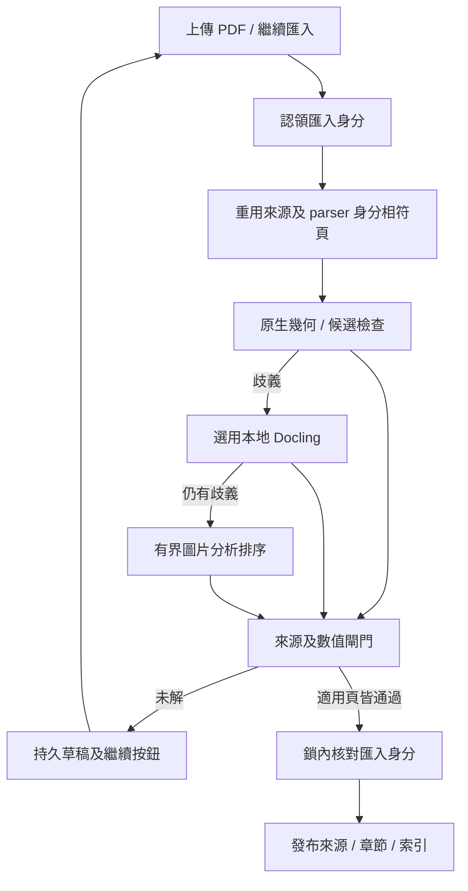

# PDF 多欄匯入與閱讀順序裁決設計規格

[English](pdf_multicolumn_ingestion_design_spec.md) | [文件索引](../../README.md)

狀態：**implemented — 等待 PR 審查**。基準：`main_v2` 的 `7cef87c`。本規格修訂外部草稿 `pdf_ingestion_multicolumn_design_spec.md`；不修改玩家回合流程。「已核准劇本來源」指已發布、可回溯 PDF 的文字，並不等於已成立世界事實或玩家已發現的內容。

## 問題與實測

目前已有 PyMuPDF 幾何資訊、PyMuPDF4LLM、MarkItDown、逐頁數值配對檢查、局部 OCR、限量 AI 修復、圖片／地圖擷取與診斷。`pdf_quality.select_text()` 依文字與數字覆蓋率選候選，卻沒有檢查閱讀順序，因此文字完整仍可能錯欄。

使用現有選擇函式單頁重現，兩份劇本的正確候選剛好相反：

| PDF 實體頁 | 目前選擇 | 對照頁面版面的結果 |
| --- | --- | --- |
| `The_Haunting_Scenario_trimmed.pdf` 第 14 頁 | PyMuPDF4LLM | 右欄 Extension／Walter Corbitt 被排在左欄 Conclusion／Rewards 前；原生雙欄排序正確。 |
| `Dead Boarder.pdf` 第 5 頁 | PyMuPDF4LLM | 原生文字把右欄 Rules Notes 排在左欄 Keeper Considerations 前；選中的版面文字較正確。 |
| `The Lightless Beacon - Call of Cthulhu.pdf` 第 6 頁 | 原生文字 | 兩個候選的標題順序一致；版面候選缺少數值依據。 |

這些是黃金樣本候選，尚非完整語料或全書正確率證明。原生文字層與任何單一 parser 都可能出錯。

## 目標與第一版範圍

先改善有原生文字層的雙欄頁與跨欄標題，根據逐頁幾何證據裁決。Docling 的完整 PDF 版面管線只作疑難頁的選用候選。保留現有數值、OCR、角色卡、地圖、來源審閱、翻譯與遊戲流程。由使用者提供的劇本建立少量真實黃金頁；已知錯序頁都要修好，原本正確頁、數字、骰式與來源跨度不得退步。

後續階段才處理結構化表格（適用時含 Camelot）、掃描雙欄的區域 OCR／Vision、複雜 sidebar。Marker 與 Nougat 不列第一版依賴。掃描頁若沒有文字層幾何，不能靠原生文字 gutter 偵測宣稱有把握。

## 必須保留的現有契約

- `pdf_loader.extract_text()` 維持五項回傳，完整 `scenario.txt` 繼續使用 `--- 第 N 頁 ---` 標記。劇本庫、章節、RAG、來源審閱與翻譯都依賴這種表示。
- `parse_quality.json` 保留原生／版面候選、block 證據、數值配對、修復嘗試、衍生描述與警告；新增逐頁決策，不取代原報告。
- 來源單元與 Unicode `[start, end)` span 以最終輸出的 `scenario.txt` 計算，不能對 parser 原文計算。
- `source.pdf` 不變；劇本文字內容 hash 與 PDF 位元組 hash 意義不同，需要時分開記錄。
- `scene_map.analyze_page_image()` 的地圖圖譜與逐字轉錄分開。角色卡空白 Luck 與既有未解欄位規則不變。

## 內部頁面模型

```text
PdfPageEvidence
  PDF 頁碼、尺寸、旋轉、原生 blocks、words、圖片、
  候選、選定區域、決策、診斷

PdfBlock
  頁內穩定 ID、文字、可空的 bbox、座標系、
  角色、欄／區域、閱讀順序、extractor、配對證據

ExtractionCandidate
  extractor／版本、頁碼、文字或 blocks、原來源、
  定位狀態、數值配對結果、診斷
```

bbox 可空。Markdown 候選沒有核實幾何位置時，不得偽造 PDF 座標。近似文字配對只可把候選段落定位到原生 block，不能修改段落文字；須一對一、達到校準後的最低分，並明顯領先第二候選。重複文字、數字、骰式、否定詞另外檢查。仍無法定位時標為疑點頁。

內部頁面證據是新增的；即使重新整備所有劇本，已發布的文字與 span 介面仍相容。

## 建議流程

```text
PDF 位元組與不可變 hash
  → 原生 blocks／words、既有逐頁候選
  → 文字欄、跨欄標題、浮動區域偵測
  → 候選文字與幾何配對、錯序診斷
  → 本地幾何排序；疑難頁可加入 Docling 候選
  → 仍有歧義時才用有限額的圖片分析判順序
  → 數值／配對／來源檢查與逐頁裁決
  → 合格頁文字、既有頁碼標記渲染
  → scenario.txt → 章節／來源單元／翻譯／RAG
```

不能只比較加權總分。先驗硬限制：必需來源文字不得遺失、數值配對不得退步、來源跨度須對齊、段落位置須有依據。合格候選之間才比較閱讀順序與完整性。原生幾何是證據，不是自動真相。決策保存選中的候選、原因、區域配對、把握程度與警告。Docling 也要過相同閘門，不能單獨決定發布。選用依賴缺少或逾時時保留既有候選並記診斷；都不可靠就留草稿頁，不偽造勝者。近似配對最低分與領先第二名的差距，先用黃金頁校準，再固定於有版本的設定與回歸測試；不在量測前猜值。

圖片分析請求提供該頁圖片或限界區域截圖、穩定候選／block ID 與短段候選文字。結構化回覆只能指定區域位置、這些 ID 的閱讀順序，以及明列未解 ID。Python 驗 ID 都屬於此頁、必需 ID 各出現一次、區域配對符合幾何，組裝後文字仍通過原有數值／配對／來源閘門。模型自己重寫的散文一律拒絕。現有 OCR 修復處理不可辨識字，地圖分析處理地圖空間。第一版不改掃描、地圖、角色卡、表格及局部修復路徑。區域 OCR 和表格專用解析留後續。純視覺描述仍要標明是衍生內容，不能當逐字來源引文。

## 草稿與發布

合格頁與診斷可以先存在匯入草稿；閱讀順序或來源缺漏未解的頁面個別待修。修復路徑改為全自動：先跑本地幾何，疑難頁再試 Docling；仍有歧義才交給設定的 `ANALYSIS_PROVIDER` 圖片分析。目前它可用 OpenAI、Anthropic 或 Gemini；Codex 不負責 PDF／圖片分析。分析結果只是候選，仍須通過來源、順序與數值閘門，不能自行核准。首版新增閘門要求所有適用的原生文字頁通過閱讀順序檢查；掃描、地圖、角色卡及表格保留既有檢查並標為 `legacy_route`，不宣稱新驗證能力。空白圖像頁或圖像擷取失敗阻擋發布；已發布舊版仍可使用。正式發布沿用可信劇本來源交易；文字改變時，按來源 hash 使舊翻譯、紀錄與索引失效。

provider 逾時、順序無效或額度用盡時，只有限次自動重試，並保留有逐頁原因的可續跑草稿。「繼續匯入」只重做未解頁，並核對已保存的 PDF hash 與管線版本；合格頁直接重用。無效回覆不得因重試而默默通過，也不重跑整本 PDF。來源或管線識別改變時，需重新核對受影響頁面。

既有「外部 AI 英文來源整備」仍是獨立的操作者流程；這條自動版面修復路徑不要求操作者把檔案轉交網頁 AI。

## 版本與成本

記錄 PDF hash、擷取管線版本、渲染版本、逐頁候選版本與最後劇本文字 hash。PDF、parser 輸出或渲染結果改變時，不可默默重用過期來源跨度或中文包。由操作者逐本選擇重新整備，不在背景自動重解析或取代舊版。Docling 只跑疑難頁；圖片分析只跑其中仍有歧義者。設定每本有限的圖片分析頁數／請求額度及每頁重試上限，初始值由黃金樣本與匯入耗時量測校準。分別量測呼叫數、排隊／處理時間、失敗及品質改善。匯入時間可增加；正常遊戲不可新增 LLM 呼叫或即時 PDF 解析。

## 測試與發布門檻

1. 真實頁面黃金順序：至少涵蓋 The Haunting 與 Dead Boarder 這兩個反向案例、正確對照頁、跨欄標題及重複數值／NPC 區塊。
2. 合成頁面：不明 gutter、分數接近的近似配對、重複文字、旋轉座標、數字或否定詞遺失的候選。模擬 provider 須涵蓋未知／重複／缺少 ID、企圖改寫文字、逾時、額度用盡、重試，以及續跑時不重做合格頁。
3. 現有 `pdf_quality` 數值配對、局部 OCR、AI 修復、地圖、角色卡、劇本庫、來源審閱、翻譯與 RAG 測試全過。
4. 最終頁碼標記、Unicode spans 與來源引文對齊；舊劇本仍可載入，來源改變會使衍生資料失效。
5. 與舊管線比較逐頁順序、文字／數字召回、來源對齊、parser 呼叫與匯入時間。所有已知錯序黃金頁修正，正確對照頁、數字、骰式與 spans 零退化才可發布。

## 訪談已定決策

- 疑點頁由已設定的圖片分析 provider 自動修復，結果仍需通過程式驗證；不要求人工轉交網頁 AI。
- 舊劇本維持可用；操作者逐本重做，且新版全部合格後才發布。
- 「已核准劇本來源」與「已成立世界事實」分開使用；來源文字不自動代表玩家已發現。
- 近似配對門檻以真實黃金頁校準，再寫入 parser 版本與測試。

## 追加決策

- 圖片分析失敗時有限次自動重試；未解頁留可續跑草稿，操作者不必編修或轉交頁面內容。
- 圖片分析只排序及定位現有候選文字；OCR／轉錄維持原有受限路徑。
- 本地幾何與選用 Docling 先行，仍有歧義才用圖片分析；新增圖片分析用量設有獨立、可量測的每本上限。

使用者以 `$implement-spec` 明確授權實作。


## 已交付介面與操作限制

- `pdf_layout.analyze_page()` 回傳來源 block、word 幾何、候選配對及已接受／未解／不適用的裁決；`apply_order()` 只能組合原 block 文字的完整排列。近似配對門檻 0.94、領先差 0.08：格式正規化後完全匹配得分 1，重複匹配保持疑點。三個真實黃金頁與合成缺字／重複案例支援初始校準，不能推論全庫準確率。
- `pdf_layout_adapters.resolve_page()` 先選用本地 Docling，仍不明確再要求 `ANALYSIS_PROVIDER` 只回傳排序。子程序期限及停用 SDK 重試限制每次成本。Docling 疑難頁候選預設啟用，先執行 `python scripts/setup_pdf_layout.py` 安裝並整備模型；缺依賴或離線模型時走有界後備。一般啟動不載入模型。
- `pdf_loader.extract_text()` 維持五個回傳值，新增已驗證頁快取與持久預算。`LayoutReviewRequired` 帶完整擷取結果及報告，供發布前保存草稿。
- `/coc scenario continue`、`status`、`cancel` 操作群組綁定的私人草稿；Discord 繼續按鈕走原 router 與權限。取消及發布共用匯入身分與群組鎖。
- 初始上限：8 次排序請求、4 個不同頁面、每頁 1 次重試；圖片分析期限 30 秒，選用 Docling 45 秒。這是保守操作上限，並非最佳值實測。續跑保留累計用量；明確提高設定上限才能補足額度，已接受頁不重跑。額度用完時提示調整設定或取消，不要求人工核對內容。
- 快取核對 PDF、pipeline、renderer、parser 版本；續跑保留文字、圖片、地圖與衍生描述來源。失敗頁不得當作已接受重用。
- 本版只新增原生文字多欄發布閘門。掃描、地圖、角色卡及表格保留既有檢查，明確標為 `legacy_route`，不代表已通過新閱讀順序驗證；空白圖像頁或圖像擷取失敗仍會阻擋發布。不得宣稱掃描頁已獲得新的驗證能力。



## 驗證

[實測與限制](pdf_multicolumn_ingestion_validation_zh.md)。整本掃描只量測幾何適用性，不代表每頁可發布。Docling 2.131.0 已測九個真實頁面：六個排序候選通過、三個拒絕；三次實際子程序保留全部來源詞，成本與限制見實測文件；玩家回合沒有新增 LLM 呼叫。


## 實作任務關係

| 任務 | 依賴 | 交付 |
| --- | --- | --- |
| T1 幾何裁決 | 無 | 原 block 排序、候選配對、黃金測試 |
| T2 選用 adapters | T1 介面 | Docling 與有界圖片排序 |
| T3 可續草稿 | loader 契約 | 持久認領與 router 控制項 |
| T4 發布整合 | T1、T2、T3 | 來源閘門、身分快取、發布 checkpoint |
| T5 發布驗證 | T4 | 樣本、API smoke、完整檢查、雙軸審查 |

## Docling 補完修正

首輪漏了 Docling 2.131.0 的實際轉換驗證。九個提供頁面皆轉換成功，但整個 block 的字面配對因拆段與表格區域表示而全部退回。adapter 改吃有順序的來源座標矩形，依完整幾何覆蓋對回未修改的原生 block ID；跨欄合併或交錯片段有歧義時拒絕。不能用 Docling 文字替換來源。完成本地模型整備後預設啟用候選；安裝／模型準備明確執行，匯入時不下載。
