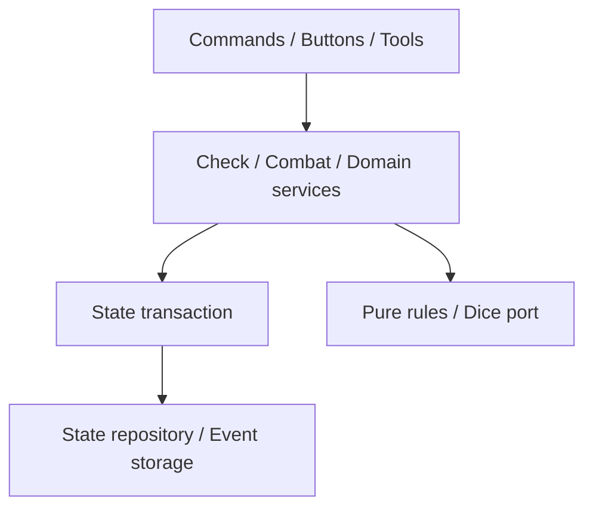
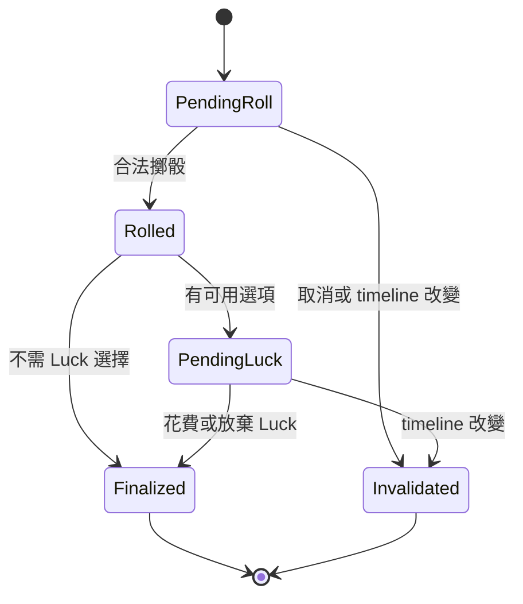

# CoC Keeper 架構重構規格：Phase 1–4

[English](architecture_refactor_phases_1_4_design_spec.md) | [文件索引](../../README_zh.md)


版本：1.0  
日期：2026-10-04  
目標專案：`marcoliu99/line-coc-keeper`  
目標基線：實作時確認的 `main_v2` commit  
用途：交給 Codex CLI 分階段實作與驗收

## 1. 任務與證據範圍

本次範圍是前述 roadmap 的 **Phase 1–4**，不是原始 HTML 的 Candidate 1–4：

| PR / Phase | 目標 | 對應原始 review |
| --- | --- | --- |
| 1 | 統一 State Transaction | Candidate 4 |
| 2 | 統一 Check Engine 與檢定生命週期 | Candidate 2 |
| 3 | 統一 Combat Engine、移除戰鬥循環依賴 | Candidate 5 |
| 4 | 遷移剩餘職責並移除 `legacy_commands` | Candidate 1 |

依據為 `architecture-review-20261004.html` 與本次對話確認的方向。本規格已讀取該 HTML，但沒有重新檢查最新 repository；報告中的行數、呼叫次數與函式位置只是定位線索，不能當成實作時仍成立的事實。

原報告指出 state 寫入旁路、重複 check resolution、combat 循環依賴、handler 依賴 legacy private API；其中 combat 部分僅檢查函式清單與分支，沒有完整讀取 body。實作者必須先追蹤實際呼叫鏈，再決定最小修改方案。

本次交付是實作規格，不表示程式已修改、測試已通過或架構問題已修復。

## 2. 成功標準與不可改行為

核心原則：**AI 理解意圖、選擇合法操作與敘事；遊戲引擎負責骰值、資源變更、檢定生命週期與一致性。** 不要求增加另一個 LLM、另一輪推理或新的 narrator service。

完成後必須滿足：

1. 所有遊戲狀態寫入經過同一 transaction boundary，不能以舊 snapshot 覆蓋新狀態。
2. 同一個 action 重試、按鈕重送或 continuation 重跑，不得重骰、重複扣血、扣 SAN、扣 Luck、扣彈藥或重複推進回合。
3. command、button、tool 的同一種檢定共用同一生命週期與規則判定。
4. CombatEngine 在不需要玩家輸入的連續步驟內完成 deterministic 結算；遇到玩家選擇即保存 pending 並返回。
5. `legacy_commands.py` 最終刪除；不得改名搬成另一個 God Module。
6. 既有遊戲、存檔、指令、按鈕與 tool schema 保持相容；新增欄位採可讀取舊資料的方式。

行為限制：

- 保留繁體中文與既有 Keeper 風格、劇透邊界。
- 保留 autoroll 預設 off 及既有玩家擲骰／防禦／Luck 選擇流程。
- 依本專案既定政策，SAN 檢定、決定瘋狂的 INT 檢定，以及戰鬥引擎登記的傷勢檢定（重傷、瀕死、穩定傷勢）不可使用 Luck；這是本專案需求，不在此宣稱為所有 CoC 桌規的唯一版本。
- 產品決定：戰鬥的攻擊與防禦擲骰，以及戰鬥以外串在重傷後的 CON 檢定，維持原本提供 Luck 的行為，規格據此修訂為與現況一致（原本寫「戰鬥檢定不可使用 Luck」）。
- 不把合法的 resolved-check consequence、非戰鬥傷害、新觸發檢定或 Dodge 一律封鎖。以 actor、原因、來源事件與目前狀態驗證，不再只靠工具名稱白名單。
- 保留既有 correction 能力；已結算結果需要更正時走明確 correction action，保留原事件及更正來源，不靜默覆寫。
- 不修改 OCR、layout、數值驗證、fallback 順序、劇本匯入門檻、地圖抽取演算法或 provider 選擇。
- 保留 playable-first 政策：不得因本次重構新增警告即使原本可玩的劇本無法開始。
- 不重構 `supervisor` / TurnCoordinator，不刪 pipeline stages，不做 Discord 全面清理；必要 caller 接線可調整。
- 不藉重構新增武器資料庫、改武器技能映射或重新定義戰鬥規則；以當前資料與已確認規格為基礎。

若現有行為與上述限制衝突，先記錄為明確缺陷，以具名 regression case 修復；不能偷偷修改 golden expectation 讓測試通過。

## 3. 開工盤點與提交方式

### 3.1 基線盤點

讀取適用的 `AGENTS.md`、`CONTEXT.md`、ADR、現有架構文件與相關測試；不存在就記錄，不自行假設內容。確認工作樹與使用者未提交修改，不能覆蓋、reset 或清除。

記錄 branch、完整 commit SHA、依賴版本、PR155/156 的實際合併狀態。不要再次 cherry-pick 已合併 PR，也不要硬編碼本文件撰寫時的分支狀態。

以 `rg` 搜尋並追蹤以下路徑及別名／wrapper，產出 migration inventory：

| 類別 | 盤點內容 |
| --- | --- |
| State | `save_state`、直接 DB 寫入、reset/restore、character mutation、snapshot/cache refresh |
| Transaction | `mutate_tool_state`、`_mutate_and_save_state`、`_save_state_checked`、`_commit_turn_result`、lock 所有權 |
| Checks | `dice.skill_check`、pending、Luck、SAN、INT madness、opposed checks、resolved event、consequence |
| Combat | `combat` / `combat_flow` / resources / rules / bridge、managed flag、HP/ammo/turn 寫入 |
| Legacy | router、handlers、`commands/__init__`、測試、runtime import、monkeypatch target |

每列至少包含：入口、state read、state write、目前 lock、事件持久化、外部副作用、目標 owner、測試、遷移狀態。

### 3.2 提交與依賴

順序固定為 PR1 → PR2 → PR3 → PR4。可用 stacked PR 或順序 commits，但每個 Phase 必須有可驗收 checkpoint，下一個以前一個通過的內容為基線。不可四個 PR 各自從舊 `main_v2` 實作後才處理相互衝突。

每個 Phase 在既有測試框架新增能捕捉實際風險的測試，不寫只驗證新增函式存在的空殼測試。非必要不增加框架或服務依賴。

## 4. 共同設計契約

### 4.1 識別與回傳

以下名稱是建議契約；優先沿用現有等價型別，避免建立兩套模型。

| 欄位 | 契約 |
| --- | --- |
| `conversation_id` | 狀態與隔離邊界 |
| `timeline_id` | reset/restore 等操作切換的遊戲世代，讓舊互動失效 |
| `revision` | 同一 timeline 內成功寫入的遞增版本 |
| `action_id` | 同一語意操作重送時保持相同；不同合法操作不同 |
| `check_id` / `combat_action_id` | 檢定或戰鬥操作穩定識別，不因 continuation 重跑改變 |
| `event_id` / `causation_id` | 結果事件與引發此事件的原因；不能只用敘事文字辨識 |
| `request_fingerprint` | 同 action ID 的 payload 指紋；payload 不同應回 conflict |

Tool retry 的 action ID 必須由可信入口與已持久化關聯決定，不能完全依賴 LLM 每次生成一個新 UUID。使用者刻意再次進行相同行動應取得新 ID，不能僅用文字內容去重。

統一 outcome 至少表達：`applied`、`duplicate`、`awaiting_input`、`stale_timeline`、`conflict`、`rejected`。`awaiting_input` 可能已成功提交 pending；不能等同 rollback。可重试 storage failure 與規則拒絕須可區分。

結果應含 revision、事件引用、pending 選項與可敘事的已提交事實；不要將 mutable state reference 洩漏給 caller 任意修改。內部結果可含 Keeper 資訊，但傳送給玩家前仍須經既有可見性／劇透處理。

### 4.2 依賴方向



Domain service 決定 mutation 與事件內容；transaction 負責併發、檢查與原子提交；repository 負責底層存取。Rules 不可 import Discord、Keeper、LLM provider 或 repository。Domain service 不可反向 import handler。

## 5. PR1 — State Transaction

### 5.1 目標

將 Keeper 的既有 reload-under-lock discipline 提升為共用寫入入口，涵蓋 tools、commands、buttons、turn commit、reset/restore、maintenance 與背景更新等實際遊戲狀態 writers。

建議位置為 `app/repositories/state_transaction.py`，或既有架構中等價的 service；不可因命名另建第二套 StateStore。

### 5.2 操作順序

**取得該 conversation 的鎖 → 在實際 storage transaction 內讀最新狀態 → 驗證 timeline → 檢查 action 去重與 payload → 檢查 revision／前置條件 → 執行 mutation → 驗證局部不變量 → 原子保存 state、events、action result → commit → 更新或失效 snapshot → 排程傳送。**

不要先讀 state 再取 lock。Process-local lock 只能保護同一 process；先確認 deployment 是否有多 process／worker。即使目前單 process，repository 仍須用資料庫 transaction／條件更新等機制防止另一個 writer 覆蓋，或明確落實部署互斥限制並留下驗證證據。

`expected_revision` 有兩種使用方式：

- 依 snapshot 計算出的 LLM／玩家 action：嚴格驗證 revision 或必要領域前置條件；不相符返回 conflict，不把整份舊 state 寫回。
- 可依最新資料重新計算的 deterministic delta：在鎖內讀取最新狀態並驗證相關前置條件後套用，不需要因無關欄位變更一律拒絕。

同 timeline、同 action ID、同 payload 的已完成重送，應在 revision conflict 前回傳原結果；同 ID 不同 payload 必須拒絕。舊 timeline 的按鈕不可當作目前操作重播。

### 5.3 API 草案

```python
result = state_store.mutate(
    conversation_id=conversation_id,
    expected_timeline=timeline_id,
    action_id=action_id,
    request_fingerprint=fingerprint,
    expected_revision=expected_revision,
    mutation=apply_to_latest_state,
)
```

`mutation` 只處理當次最新 state 與 staged events。不可在內部呼叫 LLM、OCR、Discord、網路、長時間磁碟任務，也不可再次開同 conversation transaction。Check／Combat 組合操作應共用同一 tx context 或純 resolver，避免 nested lock／多次 commit。

依原有 async/sync 寫法選擇一致 API，不在 event loop 內引入長時間同步阻塞。

### 5.4 原子性與失敗恢復

- 若 state、events、去重紀錄位於同一 SQLite DB，必須共用同一連線／transaction 提交，不能各自 commit。
- 若存在不同 storage，採持久化 outbox 或可恢復 journal；不得把多次獨立 save 稱為 atomic。避免為此導入整套 event sourcing。
- transaction 失敗，working copy 不得污染共享 in-memory state；exception／cancellation 不可留下半成品。
- 已 commit 後 cache refresh 失敗：失效 cache 並重讀，不得重做 action；以 revision 防止較舊 refresh 蓋掉較新快照。
- 已 commit 後 Discord／LLM 失敗：重試 delivery／narration，沿用 committed result，不重骰或再次修改 state。
- reset/restore 自身也走受控 transaction；timeline 使用不會與舊資料碰撞的識別，restore 不復活舊互動。
- 去重紀錄的保存期限須覆盖按鈕／action 可重送期間；若清理紀錄，還須由 timeline、terminal check／action state 阻止重複結算。

### 5.5 遷移與 architecture guard

先把 Keeper 既有實作接到共用入口，再逐類遷移 writer；禁止同一路徑新舊雙寫。PR 內允許暫時 adapter，但 PR1 完成時所有本範圍 writers 必須收斂。

Architecture test 應依 AST／import alias 追蹤已知低階 state write symbol，不能只搜尋字串 `save_state(`。允許 repository 中的低階實作，以及 transaction module 呼叫它；禁止其他 production caller 繞過。這不等於禁止無關 repository 寫入自己的非遊戲狀態資料。

若有必要的 schema migration／初始化腳本，明列靜態 allowlist、用途與測試；不可放寬為整個 handlers 或 services 目錄。

局部 invariants 不應重新驗證整份歷史劇本或阻擋既有不完美存檔。針對此次更動的 HP、SAN、ammo、pending identity、timeline 等欄位使用現有合法性規則。

### 5.6 PR1 驗收

| ID | 場景 | 必須結果 |
| --- | --- | --- |
| S1 | 同 conversation 兩個有效 delta 同時修改不同資源 | 兩項更新保留、revision 有序，無 lost update |
| S2 | 多 connection／worker 同時修改同一 state | 依 storage 契約序列化或明確 conflict，無覆蓋 |
| S3 | 同 action 同時提交兩次 | 一次 applied、另一回原結果，事件與扣值只有一份 |
| S4 | 同 action ID 不同 payload | conflict，state 不變 |
| S5 | reset 後點舊按鈕 | stale timeline，無骰與 mutation |
| S6 | state/event/result 保存期間注入失敗 | 全 rollback，重啟後亦無部分成功 |
| S7 | commit 成功後傳送失敗再重試 | 重用結果，不重新結算 |
| S8 | 較舊 cache refresh 晚到 | 不覆盖新 revision |
| S9 | mutation 拋例外／取消 | 不污染 cache，lock 可再使用 |
| S10 | 不同 conversation 並行 | 無跨對話資料污染；process lock 不使用全域單鎖 |

## 6. PR2 — Check Engine 與生命週期

### 6.1 職責

統一 intent → eligibility → roll → tier → Luck／pending → final result → resolved event → consequence 的語意。優先吸收既有 `check_lifecycle`、`check_identity`、`luck`、`resolved_check_consequences`、`services/opposed_checks`，不平行維護第二套。

可採 `checks/models.py`、`resolver.py`、`pending.py`、`luck.py`、`consequences.py`、`service.py`；這是責任示意，沒有需求的小模組可合併。持久化仍依賴 PR1，不另做一個直接 save 的 check persistence 層。

### 6.2 契約

`CheckIntent` 至少含 actor、check kind、skill/attribute、difficulty、bonus/penalty、source、context、causation ID 與需要的權限資訊。目標值應從最新角色資料與可信規則解析；LLM 傳入的 target／allow_luck 不能直接授權或覆寫角色能力。

`CheckResolution` 至少含 check ID、原始 dice evidence、effective roll、target snapshot、tier/outcome、status、Luck 選項、已提交 consequences、pending／follow-up 引用。區分 proposed、awaiting input 與 committed，不能把未套用傷害敘述為已扣血。

提供可注入的 dice port；production 接現有骰子實作，測試接 scripted dice。統一相同檢定的亂數呼叫次序；不可新增不必要的重骰。

建議公開操作：`request_check`、`resolve_pending_check`、`choose_luck`、`finalize_check`，或等價少量 API。純 `resolve(intent, snapshot, dice)` 與 stateful service 分離，供 Combat 在同一 transaction 使用。

### 6.3 狀態轉移



此圖描述概念，不要求強制改寫既有存檔 enum。`Rolled` 可以是同 transaction 中間狀態；若持久化為 pending Luck，必須保存原骰值。Autoroll 可以在同一請求完成 request + resolve，但不可跳過合法性驗證。

Luck 未定案前，哪些 consequences 可先套用須沿用已確認規則；會受 Luck 結果影響的不可先套用又猜測回滾。角色 Luck 餘額與 pending 狀態於提交時重驗。

### 6.4 Consequence 與新檢定

- 原 check 最終結算不代表整個玩家回合必須停止。既有 outcome 可導致環境傷害、SAN／CON／INT、Dodge 或下一個 pending。
- 每個 consequence 有穩定 ID 與 `causation_id`；同一 consequence 只能 apply 一次。
- 新 check 是新的 check ID，連回原 event；不得覆寫原 pending 記錄或清掉其他玩家 pending。
- 針對合法關聯、actor、scene、timeline 與重複觸發驗證；不得用「已 resolved 所以所有 mutation 都禁止」替代規則。
- 不在此 PR 建立新 SAN 專用引擎或新敘事判斷器；保留目前 SAN loss、madness、INT 等規則，收斂執行與持久化入口。
- 保持多玩家／多 pending 現有能力；不能為了簡化改成每個 conversation 只能有一筆 pending。
- 非戰鬥合法傷害走共用 mutation／damage service 與 transaction，不能硬要求 active combat。

### 6.5 遷移對象與驗收

遷移 legacy check resolver、`keeper_tools/checks`、Keeper snapshot／event duplicate、combat check caller 與相關 command/button。保留外部 tool 名稱及輸出契約，内部轉接新 service。

| ID | 場景 | 必須結果 |
| --- | --- | --- |
| C1 | command／button／tool 同一 intent + scripted dice | tier、Luck、event、state delta 一致 |
| C2 | normal/hard/extreme/critical/fumble 邊界與 bonus/penalty | 與現有已確認規則一致 |
| C3 | autoroll off | 建立 pending，尚未消耗骰子或提前套用後果 |
| C4 | pending 重複提交或 Luck 按鈕重送 | 原骰與扣值只發生一次 |
| C5 | SAN／瘋狂 INT／戰鬥傷勢檢定要求 Luck | 明確 rejected，不扣 Luck、不改 outcome；戰鬥攻擊／防禦擲骰，以及戰鬥以外串在重傷後的 CON 檢定，依產品決定仍可用 Luck |
| C6 | 合法 Luck 成功／餘額被其他 action 消耗 | 原子結算或明確拒絕，不部分扣值 |
| C7 | 已結算 check 觸發下一次 check／非戰鬥傷害 | 合法套用，原 event 保留且可追溯 |
| C8 | SAN loss → 既有 madness INT 鏈 | 不重複擲 INT、不漏 SAN 後果 |
| C9 | 五位玩家同時 pending | 只更新對應 actor/check，無相互覆蓋 |
| C10 | opposed checks／既有重擲或 push 功能 | 保留現有支援及限制；不額外新增規則 |
| C11 | continuation／narration 重試 | 不重骰、不重新觸發同一 consequence |

## 7. PR3 — Combat Engine

### 7.1 目標與邊界

移除 `combat.py` ↔ `combat_flow.py` 循環依賴，集中 mode 選擇、pending 流程、resource ledger 與 settlement。保留 `combat_rules` 純規則邊界。

建議入口 `CombatEngine.handle(action)`；可以設在 `app/services/combat_engine.py` 避免立即與現有 `combat.py` 命名衝突。拆分 state、resources、settlement 等責任，依現況選最少必要檔案。

每個 action 入口讀取最新 encounter mode，選擇 legacy／managed strategy 一次；深層規則不再反覆讀 managed flag。**保留兩種既有 mode**，不可因 report 覺得 legacy 不必要就删除。遇到 pending mode 改變須驗證或拒絕舊 action，不能跨 mode 接續。

### 7.2 原子 action 與玩家選擇

可收斂現有多個 tools 的 deterministic 步驟，但不是整場戰鬥一次跑完：

1. 驗證 encounter、actor、target、turn、武器／資源與 action identity。
2. 透過共用 Check resolver 處理攻擊與規則允許的 NPC 骰子。
3. 若需要玩家選擇 Dodge／Fight Back／其他既有選項，保存 pending 與已產生的骰值後返回。
4. 收到玩家輸入，以同一 combat action identity 接續，重驗 pending、角色與資源前置條件。
5. 純規則處理對抗、傷害、穿刺／護甲、HP、ammo、effect 等既有規則。
6. 有重傷 CON／其他需玩家輸入的後果則再建立 pending；回合推進時點保持既有規則。
7. 每個需要提交的階段，state、event、resource ledger 與 stage completion 原子保存。

引擎可直接擲依既定規則可自動處理的 NPC 骰子，不必讓 LLM 逐次呼叫 roll tool。玩家擲骰仍依 autoroll 設定；不能以減少 tool calls 為由替玩家選防禦、Luck、武器或耗材。

### 7.3 Resource 與 settlement 契約

- 明確區分 proposed damage、rolled damage、final damage、applied damage，維持 `apply_combat_damage`／`apply_final_combat_damage` 既有語意。
- 傷害、ammo、effect、turn advance 皆具穩定 settlement／resource entry ID；重送同 stage 不重複消耗。
- 攻擊提交、ammo 消耗／保留、取消、武器改變、目標死亡、過期 defense 等情況沿用現有時點。若現況不一致，先建立行為矩陣並記錄修復決策。
- 不重新實作第二份 check tier、Luck eligibility、SAN 或 character snapshot。
- 防止巢狀 transaction：同一 phase 的 check、resources、settlement 共用 PR1 transaction；等玩家輸入時先 commit 並釋放 lock。
- 既有 tool wrapper 轉成 facade；新增聚合 tool 若有必要，必須讓舊 tool 與新 tool 使用同一 action ledger，避免混用造成雙重結算。
- 不要求 LLM 記住隱藏 resource entry ID；可信 gateway 負責綁定 pending/action identity。

### 7.4 PR3 驗收

| ID | 場景 | 必須結果 |
| --- | --- | --- |
| B1 | 近戰 Dodge／Fight Back，含成功等級平手 | 結果符合已確認的既有 rule tests |
| B2 | 遠程、ammo 耗盡、護甲／穿刺 | 資源與 damage 一致，不重複扣 ammo |
| B3 | NPC 攻擊需玩家防禦 | 返回 awaiting input，沒有擅自防禦／結算 |
| B4 | pending defense 恢復、同按鈕連按 | 沿用既有攻擊骰，damage 與 turn advance 各一次 |
| B5 | 多 NPC、多人連續戰鬥 | 每 action 歸屬與順序正確，無跨玩家扣值 |
| B6 | 重傷／死亡／CON 等後果 | 不漏 gate、不錯誤提早結束或推進回合 |
| B7 | legacy／managed 存檔與 pending | 兩種 mode 均能載入、操作與續玩 |
| B8 | 混用舊 damage tool 與聚合入口重試 | 同一 action 不二次 settlement |
| B9 | commit 或 delivery failure | 保持 PR1 原子性與重送契約 |
| B10 | 依賴檢查與全新 process import smoke | 無 combat/combat_flow cycle，含 lazy import |

相同 scripted encounter 比較改前／改後 tool invocation 與 LLM round-trip 數。無玩家輸入的 deterministic 連續段應收斂為一次 domain action；等待玩家的節點保持。純 engine overhead 報告 median/p95；不得用未實測數據宣稱玩家端延遲降低多少。

## 8. PR4 — Retire legacy_commands

### 8.1 遷移方法

先列出 `legacy_commands` 所有 symbol 與 caller，將已被 PR1–3 接管的舊實作移除，再遷移剩餘責任：

| 剩餘責任 | 目標 owner | 允許改動 |
| --- | --- | --- |
| Command parsing／dispatch | 既有 router / handlers | 接線與 public interface |
| 角色 claim、heal、correction 等 | 既有或小型 character service | 統一 transaction 與 domain 呼叫 |
| Map actions | map service／既有 domain owner | 搬移協調，不改地圖抽取與導航演算法 |
| PDF／pregen upload orchestration | ingestion application service | 原樣搬移流程與依賴注入 |
| Check / Combat | PR2 / PR3 service | 删除 duplicate code |
| State writes | PR1 transaction | 删除 bypass |

Handlers 負責輸入轉換、權限／actor context 與 response formatting；遊戲規則留在 domain owner。不能把同一大段業務邏輯複製到多個 handlers，也不要建立新的 `legacy_helpers.py` 取代原檔。

PDF／pregen 的必要搬移僅限讓 `legacy_commands` 可刪除。維持現有 tuple、provider、fallback、warnings、playability 與內容輸出；typed extraction result 與 provider abstraction 留待 Phase 6。

### 8.2 相容性

- 保留既有 command 名稱／alias、handler 入口、輸入格式與錯誤語意。
- 保留已發出的 Discord custom ID／button payload；需轉接時在正常 router 中保留 version decoder，不把 legacy module 留作 runtime 依賴。
- `commands/__init__.py` 可保留合法 public facade；删除其對 legacy 私有名稱的 re-export，不必為刪檔而破壞正當 package API。
- 更新依賴 legacy private symbol 的測試，優先測 public behavior；必要純規則單元測試可測 domain function。
- 暫時 compatibility wrapper 只能存在中間 commits；PR4 完成時 production import graph 不得再指向 `legacy_commands`。

### 8.3 PR4 驗收

| ID | 場景 | 必須結果 |
| --- | --- | --- |
| L1 | 刪除 legacy module 後啟動／import | 正常啟動，無 dynamic/lazy import 殘留 |
| L2 | command alias／help／錯誤格式 | 對外契約保持 |
| L3 | 角色 claim／heal／correction、map commands | 既有行為與權限相容，state 經 PR1 |
| L4 | 改前產生的有效 button payload | 仍可操作；過期 timeline 安全拒絕 |
| L5 | upload orchestration 使用已保存 fixture／fake provider | 呼叫順序、參數、輸出、warning/playability 一致 |
| L6 | old save + pending check／combat 載入 | 可正常續玩，無須重建劇本 |
| L7 | architecture tests | 無 legacy imports、無 private legacy shim、無 raw state write bypass |

禁止把真實劇本重新導入當成 PR4 完成的必要條件；此階段以既有 fixtures、provider fake、保存的 extraction result 驗證接線。

## 9. 共通驗證策略與交付格式

### 9.1 測試層次

1. **Characterization**：改動前，以現有測試與固定骰子記錄對外行為、state delta、event、pending、資源及回合順序。
2. **Domain tests**：共用 scripted dice 測純規則與生命週期。
3. **Storage integration**：使用真實隔離 SQLite／實際 repository backend 測 transaction、併發、rollback、重啟與去重；不能只用 in-memory fake 證明原子性。
4. **Adapter contracts**：commands、buttons、tools 經公開入口測相同操作，不 patch legacy 私有函式。
5. **Offline 五人情境重播**：中文對話 fixture，涵蓋調查、SAN、非戰鬥傷害、pending、Luck、NPC 防禦、combat、reset 與重送；不要求 500 輪作為每個 PR 的 gate。

至少有兩段完整鏈：

- 「我檢查門鎖」→ pending → 擲骰 → 結果觸發傷害／新檢定 → narration retry。
- NPC 攻擊 → 玩家選閃避／反擊 → defense roll → damage → 重傷後果 → turn advance → 重複按鈕。

State 比對可排除時間戳與隨機生成 ID 的字面值，但必須驗證 ID 關聯、事件數量、順序與 causation；不可把重要差異全部 normalize 掉。

不使用真實 Discord 群組或付費 provider 作為默认測試環境。若既有正式驗證另有授權則按其範圍執行；offline fixture 結果不得描述為已完成真實連線測試。

### 9.2 Architecture gate

- raw state writes 只在明確 storage boundary；新增 caller 不能繞過 transaction。
- Check／Combat 不 import transport、Keeper 或 LLM provider。
- Rules 無 IO、副作用與 storage dependency。
- 無 `combat` ↔ `combat_flow` 靜態或函式內循環 import。
- PR4 無 `legacy_commands` runtime imports／re-export；歷史文件可保留名稱。
- AST 檢查搭配主要入口 import smoke；不把簡單 regex 宣稱為完整依賴驗證。

### 9.3 每個 Phase 的報告

放入 repo 慣用 docs 路徑，例如 `docs/refactor/phaseN-result.md`，內容包含：

- base SHA、result SHA、實際變更檔案與責任 owner。
- inventory 遷移前後狀態、已移除 duplicate／旁路。
- 實際測試命令、結果、未跑項目與原因。
- 已知缺陷：baseline 既有／本 PR 引入／本 PR 修復分開記錄。
- 使用相同 fixture 的 state/event/pending 差異及 tool count；性能數據必須標示測試條件。
- schema／舊存檔相容方式與回退限制。

中間 Phase 尚未刪除 legacy 的事實不能誤報成全部完成；必要 gate 未通過不能只標記「待追蹤」後繼續宣稱驗收。

## 10. 回退與 rollout

每個 Phase 保持可獨立定位與回退。以新增 nullable／有預設值欄位優先；移除或重命名持久化欄位前需要明確 migration 與備份方案，不能以直接清空 state 解決。

採 route cutover，不對同一 live action 同時跑兩個會寫入的引擎。差異比對僅在複製 state、scripted dice、無外部副作用的測試環境進行。

回退前確認舊程式可讀新存檔與 pending；若不能，記錄復原程序與 downtime 條件，不宣稱單純 revert 即可。部署／正式資料移轉遵循使用者另行授權與 repo 既有流程，本文件不要求立即部署。

## 11. 可直接交給 Codex CLI 的執行指令

```text
請讀取本 Markdown，按 Phase 1 → 2 → 3 → 4 完成架構重構。

先確認 repository、工作樹、適用 AGENTS.md、CONTEXT.md、ADR、main_v2
實際 commit 及 PR155/156 合併狀態；保護使用者未提交修改。
不要把 HTML 報告的行號與數量當成已核實的最新程式事實。

先盤點寫入／check／combat／legacy caller 與既有測試，再以四個可分別
驗收的 commits 或 PRs 順序實作。檔名及 class 名可依現有架構調整，
但必須滿足本文件契約，不能只換名字或搬檔案。

Phase 1：所有遊戲狀態寫入統一 transaction；先鎖再讀最新狀態，驗證
timeline、action identity 與前置條件，原子提交 state/events/result。
Phase 2：統一 check lifecycle、Luck、pending、resolved events、consequences，
保留合法的新觸發檢定與非戰鬥傷害，消除重複 resolver。
Phase 3：統一 CombatEngine，保留兩種 mode，移除循環依賴；可自動的 NPC
結算在 domain action 內完成，玩家選擇點必須保存 pending 並返回。
Phase 4：遷移剩餘 legacy 職責至各 owner，保留 public contract 與舊按鈕，
刪除 legacy_commands 與其 private re-export。

禁止修改 OCR/layout/fallback/validation 演算法、匯入政策、劇本門檻，
禁止全面重寫 supervisor 或 Discord，禁止增加不必要的 LLM round trip。
PDF upload 若為刪除 legacy 必須搬移，只做保持行為的 orchestration 遷移。
不重新導入真實劇本，不自行啟動付費模型或真實 Discord 連線測試。

用 scripted dice、隔離真實 storage、併發／failure injection、舊存檔、
中文五人情境與公開 adapter contract 驗收。不要只使用 mock 證明 transaction。
每階段提交結果文件與未完成項目；通過必要 gate 後繼續下一階段，
不要因例行檔名或模組配置問題反覆要求確認。

若遇到會改變玩法、刪資料或無法安全處理的相容性問題，先完成其他
可完成工作，提出具體衝突、已查證證據與最小選項；不要自行擴大範圍。
最後列出四階段完成狀態、測試證據、已知限制與 commit／PR 對應。
```

## 12. 最終完成清單

- [ ] PR1：所有本範圍 state writers 統一，storage 原子性與去重已驗證。
- [ ] PR2：check lifecycle 收斂，多人 pending、Luck 與 consequence 正確。
- [ ] PR3：CombatEngine 接管，無 circular import，玩家決策點保留。
- [ ] PR4：legacy module 刪除，public interface／舊按鈕／舊存檔相容。
- [ ] 無 OCR／劇本匯入／turn pipeline 的非必要改動。
- [ ] 每階段有真實驗證報告；未測項目清楚列出。
- [ ] 可用中文五人 offline 情境完成調查到戰鬥並驗證重試無雙重結算。
- [ ] 未把本規格、offline 測試或程式重構宣稱為正式部署或真實連線驗證。
