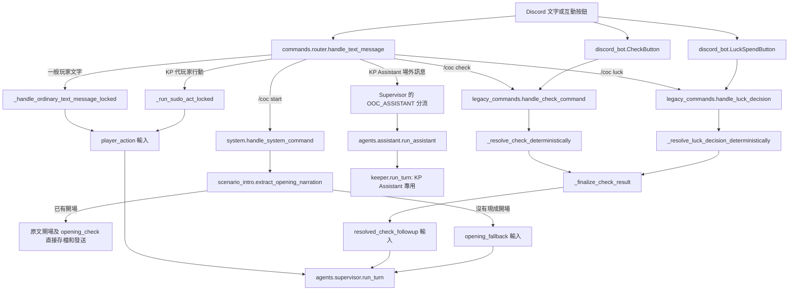
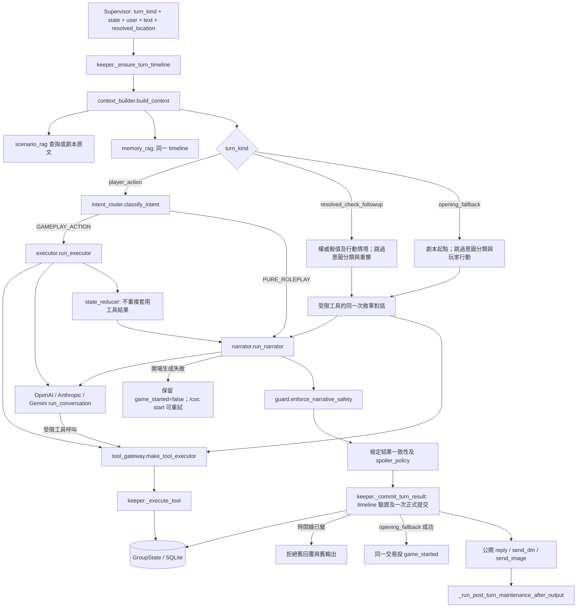

# 設計規格草案：統一玩家 Keeper 回合流程

## 狀態與目標

實作中。工作分支：`refactor/unify-keeper-turn-flow`，整合目標：`main_v2`。本期讓一般玩家文字、已結算檢定後續，以及 `/coc start` 沒有現成開場白時的生成，全部經過**同一條 Supervisor 玩家回合管線**。KP Assistant 是獨立的主持 agent，保留自己的場外對話與正式事件升格流程，不納入玩家管線。

「單一流程」要求共用**上下文準備 → 行動／既定結果 → 敘事 → 輸出保護 → 正式提交**各階段及資料契約，不能把 `keeper.run_turn` 包進 Supervisor 後仍保留一套玩家專用模型迴圈。各階段可依輸入跳過不需要的工作，但沒有另一條完整的玩家回合路徑。這是**行為等價的重構**：維持既有檢定敘事、必要工具與公開文字。現況的檢定後續會進 `keeper.run_turn`，啟動一個模型對話，遇工具迭代時可能有多次 API 請求；程式上的「跳回 Keeper」本身不是額外 API 請求。統一後量測往返次數與延遲，可能因去除重複處理而下降，但不以刪減敘事為手段。PR #86 的劇情邊界改動在另一分支；實作前須與合併後的 `main_v2` 對齊，保留其正典、RAG 與劇情提示詞。

## 現況與剩餘範圍

一般玩家文字及 KP **代玩家行動**已走 `app/agents/supervisor.py`；它依意圖走純敘事快路徑或 Executor → Narrator，並共用 `keeper._execute_tool` 的權威工具。玩家劇情仍有 **2 個直接呼叫 `keeper.run_turn` 的入口**：

| 入口 | 位置 | 需要保持的行為 |
| --- | --- | --- |
| 已結算檢定後續 | `app/legacy_commands.py` 的檢定結果階段 | 骰子與角色數值已由程式提交；敘事不得重骰或重扣。部分結果可能需要後續工具，且仍須保留 Luck、待處理狀態、時間線驗證及公開／私密回覆。 |
| `/coc start` 開場後備 | `app/commands/handlers/system.py` | 劇本已有開場時繼續使用現成抽取結果與可能的開場檢定；只有缺少現成開場時才由模型依劇本資料生成，必要時可 `search_scenario`，再正確標記 `game_started`。 |

另外，`app/agents/assistant.py` 仍直接呼叫 `keeper.run_turn(..., speaker_role="kp_assistant")`。這是**刻意保留的獨立 agent**，不是本期剩餘玩家流程。它有 `kp_ooc_log`、明確 `!` 正典指令、成功工具結果的正典升格、KP 工具白名單與 OpenAI 對話鏈隔離；本期不得為了消除函式引用而搬進玩家回合。

玩家管線與 KP Assistant 已共用靜態／動態 Keeper 提示詞、工具 schema 與 `_execute_tool`。工作重點是把兩個入口轉為同一玩家管線的輸入，不重寫骰子或戰鬥。

### 所有本期入口與介面

上圖中的按鈕仍由 Discord adapter 驗證擁有者、檢定／Luck ID 與時間線；命令與按鈕共用同一個確定性結算函式。`/coc start` 的現成開場是資料抽取結果，不經模型，不改成另一個模型回合。其他管理命令、PDF 上傳與地圖操作沿用原 router；本期只改上圖三個玩家敘事入口。

普通 `GAMEPLAY_ACTION` 沿用 Executor 模型判定加 Narrator 敘事；純角色扮演只用 Narrator。已結算檢定與開場後備在 **同一個 `narrator.run_narrator` 敘事階段**完成必要工具及文字，只有一個模型對話，不固定再呼叫一次 Executor。受限工具由 `tool_gateway` 執行，最後仍走同一 Guard、劇透保護、時間線提交與輸出配送。模型可在該對話內多次呼叫工具；「單次模型對話」不保證只有一次 API request。

| 介面 | 輸入／輸出契約 |
| --- | --- |
| `router.handle_text_message`、Discord Check／Luck 按鈕 | 驗證命令、角色、按鈕身分及對話鎖；文字和按鈕各自進入相同的確定性檢定／Luck 結算函式。一般文字與 KP 代操作進 `player_action`。 |
| `legacy_commands._finalize_check_result` | 接受已提交的骰子／Luck 結果、角色、`check_id`／`decision_id`／`timeline_id` 與原行動情境；等候 Keeper 回合鎖、重讀狀態，驗證角色及時間線後傳入 `resolved_check_followup`。不再呼叫玩家版 `keeper.run_turn`。 |
| `system.handle_system_command` 的 `/coc start` | 驗證劇本、角色及 Luck 待決；`extract_opening_narration` 有現成文字時直接保存，沒有時以 `opening_fallback` 呼叫 Supervisor。 |
| `supervisor.run_turn` | `state, user_id, display_name, text, resolved_location, speaker_role, conversation_id, turn_kind, resolved_check_context` → `(public_text, private_messages, image_requests)`；`turn_kind` 只接受 `player_action`、`resolved_check_followup`、`opening_fallback`。 |
| `context_builder.build_context` | 收同一組角色、劇本、時間線；回傳 `AgentMessage`，含 RAG、Memory、最近已結算事件。開場及檢定後續也走此階段。 |
| `intent_router.classify_intent` | 只分類一般文字；已結算檢定及開場使用明確類型，不能被文字中的「擲骰」「走」誤判為新行動。 |
| `executor.run_executor` | 只處理一般遊戲行動；經 `tool_gateway` 呼叫權威 `_execute_tool`，已寫入狀態的結果由 `MechanicResult` 傳給 Narrator。 |
| `narrator.run_narrator` | 一般文字無工具；檢定後續只提供查詢及必要戰鬥後果工具，開場只提供查詢／展示工具。回傳敘事、私訊及圖片請求；工具名稱在實際執行處再次驗證。 |
| Provider `run_conversation` | Executor 與 Narrator 仍使用 OpenAI／Anthropic／Gemini 的既有介面；特殊輸入由 Narrator 的一次工具對話產生最終文字，可在該對話內迭代工具。 |
| `keeper._commit_turn_result` | 在狀態鎖下比對時間線、一次追加正式 log；開場後備同一交易設定 `game_started`，失敗時保持可重試。 |
| `_run_post_turn_maintenance_after_output` | 提交成功後才送公開文字、私訊及圖片，再排程既有記憶／摘要維護；失效時間線不配送工具副作用。 |
| `assistant.run_assistant` | KP Assistant 經 Supervisor 的 OOC 分流進獨立 agent，仍呼叫 KP 專用 `keeper.run_turn`；OOC 歷史和主持正典規則不併入玩家管線。 |

**工具權限**：檢定後續沿用 `RESOLVED_CHECK_FOLLOWUP_TOOL_NAMES`（唯讀查詢、傷害結算、戰鬥回合推進），不能使用 `skill_check`／`sanity_check` 等再建檢定的工具。開場後備允許劇本／記憶查詢及必要圖片／私訊展示，不提供擲骰或狀態變更工具。兩者在工具 callback 再次核對實際名稱，避免只靠模型收到的工具清單。底層仍共用 `_execute_tool`，不另寫骰子或戰鬥規則。

## 方案

1. 定義一個玩家回合輸入契約，明確標示 `player_action`、`resolved_check_followup`、`opening_fallback`，攜帶已驗證角色、原行動脈絡、已結算事件或開場來源。三種輸入都進 `supervisor.run_turn`；檢定後續與開場不進一般文字意圖分類。
2. 共用 Context、行動／既定結果、Narrator、Guard／劇透保護及正式提交。一般玩家行動的行動階段使用 Executor；檢定後續從權威已結算事件開始，跳過原擲骰；開場從劇本與開場情境開始。需要劇本補查或後續工具時，必須在這條管線的既有工具階段處理，不能另設一個與 Supervisor 平行的完整模型迴圈。具體工具權限及何時呼叫模型，由真實案例驗證後定案。
3. 共用時間線檢查、工具副作用追蹤、失敗時的安全回覆、私訊／圖片請求與唯一正式歷史提交。後續工具若已改狀態而模型失敗，不能要求玩家重做原行動。KP Assistant 保留其獨立 agent 與 OOC 提交規則。
4. 先遷移 `/coc start` 後備，再遷移檢定後續；保留現有一般玩家與 KP 代玩家行為。完成後，玩家劇情不再直接呼叫 `keeper.run_turn`，也不透過新名稱間接回到舊玩家迴圈。

### 關鍵流程

- **檢定後續**：程式先完成骰子／Luck／狀態提交 → 權威事件進同一 Context／結果階段 → 必要後續工具及敘事進同一玩家管線 → Guard、劇透與時間線檢查 → 正式歷史只追加一次 → 交付公開與私密內容。
- **開場**：角色與劇本就緒 → 優先使用現成開場抽取結果 → 缺少現成開場才以 `opening_fallback` 輸入同一 Context／敘事／保護／提交管線 → 依劇本／RAG 生成 → 標記 `game_started` 並公開。不可把開場當成玩家行動，也不能讓意圖分類憑空建立檢定。
- **KP Assistant**：留在獨立 agent。純場外討論只進 `kp_ooc_log`；明確主持指令或正式工具結果才升格 `state.log`。本期只跑回歸測試確保無變化。

## 資料結構與相容性

預期不新增 `GroupState` 欄位或資料庫 schema。沿用 `log`、`pending_checks`、已結算檢定事件、時間線與 `openai_previous_response_id`；KP Assistant 的 `kp_ooc_log` 保持原樣。若現有事件不足以無歧義表示檢定後續，先提出最小資料變更及舊存檔預設值，不能用對話文字反推權威骰子結果。

## 非目標

- 不把 KP Assistant 併入玩家 Executor／Narrator 管線。
- 不建立第二條改名後的玩家專用 Keeper 模型迴圈。
- 不讓所有情境固定呼叫 Executor → Narrator 兩次模型。
- 不在本次重構加入「純機械結果零模型回覆」等會改變玩家敘事體驗的新功能。
- 不重寫 `_execute_tool`、骰子、戰鬥或既有 RAG 檢索策略。
- 不把 `/coc check` 已完成的骰子再交給模型重新擲。

## 驗證門檻

- 三種玩家輸入都要有實際路由測試，確認它們經過同一 Context、輸出保護與正式提交，且檢定與開場不直接或間接呼叫舊玩家 `keeper.run_turn`；KP 代玩家路徑仍工作。
- 檢定：技能、SAN、Luck、多人待處理、回溯後舊按鈕、模型失敗前後有／無工具副作用；確認不重骰、不中途重扣，正式歷史只有一次結果。
- 開場：有現成開場（含 opening_check）、無現成開場需 RAG、模型失敗、重複 `/coc start`、同時請求與時間線切換；`game_started` 與公開文字一致。
- KP Assistant 現有 OOC／正式事件升格／工具權限／對話鏈測試保持通過，證明獨立 agent 未受重構影響。
- 以現況「需後續敘事的 `/coc check` 會啟動一次 `keeper.run_turn` 模型對話，可含多次工具迭代」作基準，量測重構前後的平均 API 請求、RAG 查詢及延遲；不得為了省請求漏掉劇本後果，也不得無條件增加一次 LLM 往返。跑完整測試套件，PR 前重新對齊最新 `main_v2`。

## 待確認

`scenario_intro.extract_opening_narration` 是獨立的劇本資料抽取，不是舊 Keeper 回合。本期保留「有現成開場先使用」及其呼叫時機，只統一缺少現成開場時的模型生成流程。
